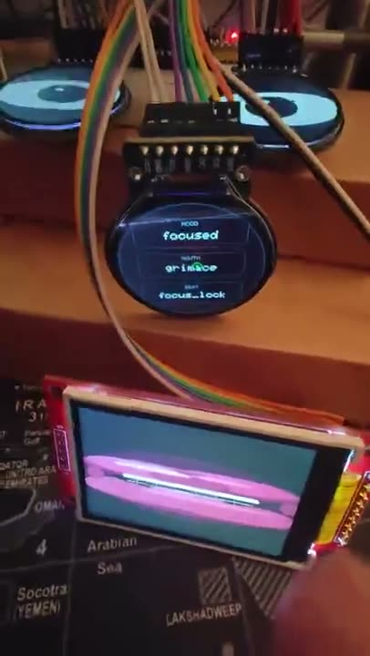

# Robot 790

Robot 790 is a local, daemon-driven animatronic robot project inspired by
LEXX 790. The project combines ESP32 device controllers, a browser STS control
page, local STT/TTS, local LLMs through LM Studio, and a small Python daemon
package for robot tools and storage.

The resident character is **Eric Robot 790**: Eric is the personage; Robot 790
is the platform, body, and series. Eric is defined by a seed prompt, a low
latency local model, a Qwen3-TTS voice, a visible face, tool access, and a small
set of plain-text continuity files. The public posture is modest: this is not
proof of a new kind of mind. It is an unusual local robot arrangement worth
watching closely.

The practical goal is older than this implementation: build a machine that is
not merely a chat box, but a companion-shaped presence - something fun,
interesting, and responsive enough to share a room with. Scott's phrase for that
target is an artificial human: not a hidden person, not a consciousness claim,
and not a replacement for people, but a made social presence with a body, voice,
habits, tools, and continuity. The motive is design, not biography:
companionship is a real target, and embodied local agents like Eric may become
one more way to make some rooms feel less empty.

Eric is not presented here as a brand-new kind of AI model. The base machinery
is chatbot-class language modeling, but the lived shape is closer to an agentic
system: tools plus a loop. Like a coding agent with Bash, Python, Playwright,
and curl, Eric is defined by the tools around the model. His toolbox is
different: face, eyes, mouth text, voice, notes, memory, web search, camera,
sensors, media, and hardware controllers. The idle/conversation loop keeps
feeding those tools and their results back into context. That tool diet and
feedback loop are a large part of what make him feel like a robot rather than a
chat box.

That loop matters economically as well as technically. Many hosted agents have
to fake ongoing attention with cron-like scheduled bursts because every token
costs money. Robot 790 is built for a local high-throughput machine, so idle
thinking can be treated as a usable runtime behavior rather than a rare cloud
event. It still has limits, but the budget shape is different.

Start with the public story, receipts, and open questions:

- [Eric Robot 790 public page](docs/index.md)
- [Receipts And Open Questions](docs/evidence_map.md)
- [The Landscape Around Eric](docs/articles/artificial-human-landscape.md)
- [What Eric Has Taught Us So Far](docs/articles/what-eric-has-taught-us.md)
- [Why The Empty Context Worked](docs/articles/why-the-empty-context-worked.md)
- [Start With Nothing But Tools](docs/articles/start-with-nothing-but-tools.md)
- [Safety Is Architecture, Not Charm](docs/articles/safety-is-architecture-not-charm.md)
- [The Overnight Run: Tools, Loop, And Second Mind](docs/articles/overnight-run-tools-loop-second-mind.md)

<p>
  
  
</p>

The short version: Eric is a made creature whose character seems to come from
the whole assembly: tools plus a loop, not a secret model or one magic prompt.

## Lineage And Contribution

Robot 790 does not claim to invent realtime voice, text-to-speech, speech
recognition, local LLM serving, tool calling, or social robotics from scratch.
It exists because those pieces already became good enough to combine.

The project grew out of experiments with Hugging Face realtime voice work,
Reachy Mini conversation tooling, local Qwen and Qwen3-TTS models, LM Studio,
OpenAI-compatible APIs, ESP32 firmware, browser UIs, and a long history of
robotics, animation, speech, and character-interface research. It stands on a
lot of shoulders.

What Robot 790 adds is the arrangement:

- a local-first speech-to-speech robot loop with a visible face
- semantic tools for face, mouth, gaze, chassis, notes, memory, web, weather,
  media, and image generation
- deterministic lifecycle cues so the body listens, thinks, speaks, and idles
  without waiting for the model to choreograph every frame
- an idle rumination system that can keep thinking from loaded context while
  the user is quiet or away
- a notes/worlds/library structure for giving the robot continuity, reference
  material, and temporary imagined substrates
- public logs, articles, and curated sessions that show the seams instead of
  hiding them

The project does not offer a secret new model or a finished theory of mind. It
offers an inspectable arrangement: an interface, body, timing layer, tool
contract, memory practice, and curation loop around powerful existing systems.
The interesting question is how far character and continuity can appear from
that assembly when the machinery is kept visible.

## Current Pieces

- `web/sts`: standalone Robot 790 STS page at `http://127.0.0.1:8790/`.
- `src/robot_790d`: Python helpers, local page APIs, realtime entrypoint
  patches, tools, memory, notes, weather, web search, Cast media, image
  generation, and smart-home proxy support.
- `src/robot_790_tts`: OpenAI-shaped Qwen3-TTS speech endpoint.
- `firmware/esp32-s3-face`: active one-piece portrait face firmware for the
  ESP32-S3-Touch-LCD-2. Current hostname: `http://esp32-s3-face.local/`.
- `firmware/esp32-face`: older external-display face firmware lineage. The
  working rig may still be reachable at `http://esp32-eyes.local/`.
- `firmware/esp32-s3-face-brain`: parked ESP32-S3 external-eye experiment.
- `firmware/esp32-chassis`: tracked chassis controller.
- `firmware/esp32-cam`: ESP32 camera controller experiments.
- `presets/robot-790-gold.json`: the current Qwen 27B / Eric voice baseline.

Some names still say `eyes` or `Reachy` in older firmware/UI paths. That is
intentional for now: preserve working hardware behavior first, rename only when
the project settles.

## Platform And License

This is currently a Windows/PowerShell lab project. The Python package and
browser code are portable in principle, but the checked-in commands, local paths,
LM Studio workflow, and ESP32 upload scripts assume Windows unless noted.

The current gold run fits on one high-VRAM consumer GPU. The active baseline is
Qwen 27B at a 131K context window with local Qwen3-TTS on an RTX 5090-class
setup; smaller or cloud models can be used through the preset system with
different tradeoffs.

No project license has been selected yet. Until a `LICENSE` file is added, the
repository is public source but not formally open-licensed. Models, datasets,
voices, third-party code, and media assets carry their own licenses.

## Project Folders

- `docs/`: public GitHub Pages shelf for articles, curated transcripts, and
  publishable media. This is the public memory palace.
- `notes/`: private local working notes, identity files, library books, world
  substrates, and experiment scratch. This folder is ignored by git by default.
- `logs/`: local live captures, event logs, generated images, and audio/video
  recordings. This folder is ignored by git by default.
- `scripts/`: startup, shutdown, model restart, docs catalog, and media helper
  scripts.
- `web/`: browser-facing control surfaces.
- `firmware/`: ESP32 face, chassis, camera, and hardware experiments.
- `src/`: Python daemons, tool adapters, and the Qwen3-TTS endpoint.
- `tests/`: focused tests for the Python helpers and page-server APIs.

## Public Docs

- [Public Page](docs/index.md): GitHub Pages landing page and article shelf.
- [Docs Folder](docs/README.md): how the static site is organized.
- [Public Media](docs/media/README.md): compression and publishing rules for
  images, audio, and video.
- [Receipts And Open Questions](docs/evidence_map.md): working map of project
  observations, receipts, and open tests.
- [Experimental Controls](docs/experimental_controls.md): STS run dials,
  interactions, and evolving presets for repeatable experiments.
- [Embodied Sensor Head](docs/embodied_sensor_head.md): ESP32-S3 face sensors,
  touch, camera, and possible tilt/rotate head direction.
- [Eric On Reachy](docs/reachy_embodiment.md): plan for making Reachy Mini a
  Robot 790 embodiment without replacing Eric's brain.
- [Future Directions](docs/future_directions.md): public-safe notes on the
  desk-show idea, singing, associative drift, library files, world substrates,
  vision, and media.
- [Reference Shelf](docs/references.md): research, projects, and practical
  ancestors that Robot 790 builds beside or on top of.

`docs/` is a static GitHub Pages site. GitHub Pages will serve it directly, but
it will not run build scripts. After adding articles, curated logs, images,
audio, or video, rebuild and commit the generated catalog:

```powershell
.\scripts\build_docs_catalog.ps1
```

For local preview, serve the folder over HTTP instead of opening
`docs/index.html` as a `file://` URL:

```powershell
python -m http.server 8088 -d docs
```

Then open `http://localhost:8088/`.

Only compressed, public-ready media belongs in `docs/media/images/`,
`docs/media/videos/`, or `docs/media/audio/`. Large originals belong in ignored
parking folders such as `docs/media/raw-video/` until deliberately curated.

## First Setup

Create and install the project environment:

```powershell
cd D:\_PROJECTS\robot-790
python -m venv .venv
.\.venv\Scripts\Activate.ps1
pip install -e .[dev]
```

Install the optional realtime voice stack:

```powershell
.\.venv\Scripts\python.exe -m pip install -e .[realtime]
```

Install the optional Qwen3-TTS endpoint stack when using
`src/robot_790_tts` directly:

```powershell
.\.venv\Scripts\python.exe -m pip install -e .[tts]
```

Private runtime settings can live in `.env`. Start from the checked-in example:

```powershell
Copy-Item .env.example .env
notepad .env
```

`start_sts_page.ps1` and `start_realtime_eric_qwen3.ps1` load `.env`
automatically. The real `.env` file is ignored by git.

## Daily STS Startup

The usual all-local STS setup has three moving parts:

1. LM Studio serving an OpenAI-compatible chat endpoint on `127.0.0.1:1234`.
2. Robot 790 realtime STS server on `127.0.0.1:8765`.
3. Robot 790 browser page on `127.0.0.1:8790`.

Here `gold` means the current best-known-good Eric runtime preset, not only the
robot's gold body color. The current gold baseline is back on the faster NVFP4
MTP build because responsive Brain1 timing matters more than the old-model
comparison for ordinary lab work.

```powershell
lms unload --all
lms load qwen3.8-27b-nvfp4-mtp --parallel 2 --context-length 131072 --gpu max --identifier qwen3.8-27b-nvfp4-mtp -y
```

Start the realtime backend:

```powershell
.\scripts\start_realtime_gold.ps1
```

Start the browser page:

```powershell
.\scripts\start_sts_page.ps1
```

Open:

```text
http://127.0.0.1:8790/
```

The page connects to:

```text
ws://127.0.0.1:8765/v1/realtime
```

If Ctrl-C does not stop a stuck process, use:

```powershell
.\scripts\stop_sts.ps1
```

Or stop one side:

```powershell
.\scripts\stop_sts.ps1 -RealtimeOnly
.\scripts\stop_sts.ps1 -PageOnly
```

## Brain Presets

The STS page Realtime Server panel has a `Brain` dropdown. Pick a model and hit
`Restart` to stop realtime, unload the current LM Studio model, load the chosen
model, and start realtime again with Eric's Qwen3-TTS voice.

Current presets:

| Preset | LM Studio model | Context | Parallel | Reasoning | Notes |
| --- | --- | ---: | ---: | --- | --- |
| Qwen 27B MTP Fast | `qwen3.8-27b-nvfp4-mtp` | 131K | 2 | `none` | Current gold baseline: faster response, less lag, and better for testing Brain1 without patience becoming the experiment. |
| Qwen 27B | `qwen/qwen3.8-27b` | 131K | 1 | `low` | Old-brain comparison preset: slower, subtly familiar, useful for calibration days. |
| Qwen 9B | `qwen/qwen3.5-9b` | 131K | 1 | `low` | Middle-size comparison model. |
| Qwen 4B | `qwen3.5-4b` | 131K | 1 | `none` | Small/fast comparison model. |
| Nemotron 30B | `nvidia-nemotron-3.5-lightning-30b-a3b` | 64K requested / 32K observed | 1 | `none` | Alternate brain. Potent and fast, but more verbose and assistant-like; verify actual context with brain status after restart. |
| OpenAI | `$env:ROBOT_790_OPENAI_LLM_MODEL` | API | n/a | omitted | Cloud LLM comparison while keeping local Qwen3-TTS voice, face, and tools. Defaults to `gpt-4.1-mini`. |
| Custom LM Studio | user-entered identifier | user-entered | 1-8 | user-entered | Paste the identifier from `lms ls` or LM Studio's load message, then restart. |

The restart script behind the dropdown is:

```powershell
.\scripts\restart_realtime_gold.ps1 -Preset qwen27-mtp-vlow
.\scripts\restart_realtime_gold.ps1 -Preset qwen27
.\scripts\restart_realtime_gold.ps1 -Preset qwen9
.\scripts\restart_realtime_gold.ps1 -Preset qwen4
.\scripts\restart_realtime_gold.ps1 -Preset nemotron30
.\scripts\restart_realtime_gold.ps1 -Preset openai
.\scripts\restart_realtime_gold.ps1 -Preset custom -Model qwen3.8-27b-nvfp4-mtp -Reasoning none -ContextLength 131072 -Parallel 2
```

The OpenAI preset uses `OPENAI_API_KEY` from `.env` and skips LM Studio model
loading. Override the model without changing code:

```powershell
$env:ROBOT_790_OPENAI_LLM_MODEL = "gpt-4.1-mini"
```

Chat text is uncapped by default so note reads, summaries, and longer thoughts
can complete instead of being clipped. A hard text cap is available only for
debug runs:

```powershell
.\scripts\start_realtime_eric_qwen3.ps1 -TextMaxTokens 192
```

`AudioMaxTokens` is still passed to the upstream realtime/TTS stack, but it
should not silently clip chat text unless `-TextMaxTokens` is explicitly used.

## STS Page

The browser page is the main live control surface. It includes:

- Realtime server connection and model restart controls.
- Sensing Eye drop target for images or text files.
- Mic start/stop, audio meter, and interruption sensitivity.
- Audio recording to trimmed local MP4 with the latest generated image as
  cover art; raw source audio is kept under `logs/audio/`.
- Generated-image preview plus operator-side image model and cost controls.
- Mouth text mode for a second visible channel: Eric can put words, captions,
  quick flashes, or hidden asides on the mouth display separately from what he
  is saying aloud.
- Face, chassis, voice, memory, web, weather, Cast, image, smart-home, and
  note tool switches.
- Idle controls for drift, wonder, self-focus, notes-focus, and substrate tests.
- Conversation and event panes with copy and record buttons.
- Context Map for a rough view of what Eric can draw from.

The page sends a compact Robot 790/Eric identity prompt with `session.update`
when it connects. It also drives deterministic face lifecycle cues:

```text
conversation UI / voice client
        |
   realtime STS server
        |
   robot_790d tools
        |
ESP32 face, chassis, camera, notes, memory, web, media
```

Clients send semantic intent such as "listening", "thinking", "look left",
"smile", "stop", "read this note", or "search this". Firmware and tool
adapters own the timing, GPIO details, display updates, and motor commands.

Current embodiment is injected separately from the permanent Eric identity so
hardware changes do not require hand-editing the page prompt. Override these in
`.env` when the body changes:

```powershell
$env:ROBOT_790_CURRENT_EMBODIMENT = "Your current embodiment is ..."
$env:ROBOT_790_BODY_TRAJECTORY = "Your body is an evolving ..."
```

- user speech: listening
- STT/LLM work: thinking
- output audio: speaking
- response completion: release back to idle

This keeps the face responsive even when the LLM is slow or odd.

## Idle And Rumination

Idle pondering is page-driven, not firmware-driven. The `Idle drift` slider is
off at `0`; higher levels let the page request one-sentence ponders after quiet
periods. Level `11` and `12` are intentionally overactive registers. Use
`Lab speed` above `1x` when the goal is to observe a lower-drift run quickly.

Idle ponders use lanes such as object noticing, callback, status, question,
addressed question, bridge, craft, curiosity, unresolved, lookup, and aside. The
`bridge` lane is the two-fact collision organ: it connects unlike details from
recent context, notes, search seeds, or memory and tries to name the hinge.
Recent idle outputs are fed back so thoughts can build on each other. Cooldown
exists for exhausted loops; finer per-topic retirement is still in progress.

The related controls matter:

- `Wonder`: raises the chance of curiosity, unresolved, and lookup lanes.
- `Self-focus`: controls how much Eric centers body, identity, and self-model.
- `Notes`: controls how strongly loaded notes shape idle material.
- `Substrate test`: suppresses ordinary Robot 790 self-reference so a loaded
  note can act as the temporary world for an experiment.
- `Run preset`: applies named starting conditions such as Mercury Research,
  Quiet Mulling, Person Lane, First Contact Prep, and Performance Set. Moving
  a dial by hand marks the run as `Custom`.
- `Lab speed`: compresses idle waits for observation while leaving the selected
  drift level and prompt register intact. In lab mode, loop detection becomes a
  visible status/log event instead of a cooldown.

Substrate mode is for experiments, not ordinary Eric. It helps answer whether a
note can become the world of the rumination loop without the chassis and normal
identity pulling everything home.

The longer runbook is in [Experimental Controls](docs/experimental_controls.md).

## Tools

The realtime page can expose these tools to the LLM:

- `set_robot_mode`: `idle`, `listening`, `thinking`, `speaking`, or `sleeping`.
- `play_face_beat`: named face animation beats.
- `set_face_mood`: named face mood for a short visual hold.
- `set_eye_style`: eye renderer style such as `robot`, `friendly`, `classic`,
  `cartoony`, `sinister`, or `sleepy`.
- `set_eye_gaze`: normalized gaze target.
- `set_mouth`: mouth style, shape, talking state, text display, energy, or
  release back to autonomous control.
- `set_chassis`: one explicit status, stop, e-stop, clear, tank, or twist
  command for the tracked chassis.
- `remember_fact` / `forget_fact`: explicit named browser memory facts.
- `search_web`: compact web search results.
- `get_weather`: current weather lookup.
- `show_web_page`: open a web page in the UI.
- `generate_image`: create one still image from a visual prompt, save it under
  `logs/generated-images/`, and show it in the STS page.
- `cast_media`: list Cast receivers, play YouTube, show direct image URLs, or
  stop Cast playback.
- `set_smart_home_device`: list, check, turn on, turn off, or toggle
  allowlisted Home Assistant `light`, `switch`, or `fan` entities.
- `write_text_file`, `read_text_file`, `list_text_files`: text-note file tools.
- `get_brain_status`: local diagnostics such as model, context, token pressure,
  latency, TTS timing, and approximate browser context contribution.

Tool routing includes a small lookup reflex: when an unfamiliar term has been
repeated, spelled, typed, or otherwise pinned as an exact string, Eric should
search before asking for more context unless the user clearly frames it as
private or local.

Image generation is opt-in from the `LLM image generation` checkbox because a
cloud provider may charge per image. The default provider is OpenAI:

```powershell
$env:OPENAI_API_KEY = "..."
$env:ROBOT_790_IMAGE_PROVIDER = "openai"
$env:ROBOT_790_OPENAI_IMAGE_MODEL = "gpt-image-1-mini"
$env:ROBOT_790_OPENAI_IMAGE_QUALITY = "low"
```

The STS page also has an operator-side image model and cost/quality selector.
Use `gpt-image-1-mini`/`low` for cheap iteration, then switch to `gpt-image-1`
and `medium` or `high` when one of Eric's visual ideas deserves a better pass.

For plumbing tests without cloud calls:

```powershell
$env:ROBOT_790_IMAGE_PROVIDER = "mock"
```

The image tool contract is intentionally small for now: Eric supplies a prompt,
optional title, and optional size. Costlier model and quality choices stay in
the operator UI or `.env`, so Eric can imagine freely without silently spending
more. Aspect ratio, style, and ComfyUI workflows can be added behind the same
tool later.

Face and chassis tool calls should still be short and explicit. The model
proposes; deterministic tool and firmware layers decide what is actually safe
and timed. Chassis motion is floor-first, speed-capped, and enforced outside the
model before the treaded body is trusted anywhere interesting.

Smart-home control uses the same rule: Eric gets simple aliases and reversible
verbs, while the local proxy owns the real entity IDs and safety policy. The
first backend is Home Assistant:

```powershell
$env:ROBOT_790_HOME_ASSISTANT_URL = "http://homeassistant.local:8123"
$env:ROBOT_790_HOME_ASSISTANT_TOKEN = "..."
$env:ROBOT_790_SMART_HOME_DEVICE_LIVING_ROOM_LIGHT = "light.living_room"
$env:ROBOT_790_SMART_HOME_DEVICE_EXTRA_LIGHT = "light.extra_light"
```

The smart-home proxy only allows configured aliases in the `light`, `switch`,
and `fan` domains. Locks, doors, thermostats, HVAC, appliances, purchases, and
other safety-critical actions are intentionally outside this first tool.

## Memory, Notes, And Logs

There are two memory-like layers:

- Browser memory facts live in browser `localStorage` under
  `robot790.memory.v1` and are injected into session instructions.
- Daemon memory facts use `memory.v1.json`; set `ROBOT_790_MEMORY_PATH` or
  `ROBOT_790_INSTANCE_PATH` to move that file.

Notes are different from named facts. They live under `notes/` by default,
missing extensions become `.txt`, and only `.txt` or explicitly named `.md`
files are allowed. Set `ROBOT_790_NOTES_PATH` to move the folder.

The note tools are intended as explicit storage: Eric should only write, append,
read, or list files when asked. Note writing should keep user-supplied facts,
session events, tool-verified facts, and Eric's own ruminations distinct. Weird
thoughts are allowed as thoughts; unverified outside facts should not be saved
as settled truth.

Live page captures are written under `logs/live/` by the Record buttons. Those
files are local lab artifacts and are ignored by git.

## Local Qwen3-TTS Endpoint

Robot 790 also includes a separate OpenAI-shaped Qwen3-TTS endpoint.

Run a mock endpoint first:

```powershell
.\scripts\start_qwen3_tts.ps1 -Mock
```

Then check it:

```powershell
mkdir samples
curl http://127.0.0.1:8000/health
curl -X POST http://127.0.0.1:8000/v1/audio/speech `
  -H "Content-Type: application/json" `
  -o samples\speech.wav `
  -d '{"input":"Robot 790 is online.","voice":"Eric","response_format":"wav"}'
```

For real synthesis, install a CUDA-capable PyTorch environment plus `qwen-tts`,
then start without `-Mock`:

```powershell
.\scripts\start_qwen3_tts.ps1 -Voice Eric -HostAddress 127.0.0.1 -Port 8000
```

The endpoint exposes:

- `GET /health`
- `GET /v1/voices`
- `GET /v1/models`
- `POST /v1/audio/speech`

Settings can be provided with environment variables; see
`qwen3_tts.example.env`.

## Firmware Bring-Up

Point the daemon client at the active ESP32 face:

```powershell
$env:ROBOT_790_FACE_URL = "http://esp32-s3-face.local/"
robot-790d state
robot-790d listen
robot-790d speak --energy 0.7
robot-790d beat mischief
robot-790d idle
```

Build and upload the active ESP32-S3 portrait face firmware:

```powershell
pio run -d firmware\esp32-s3-face -e esp32-s3-face
pio run -d firmware\esp32-s3-face -e esp32-s3-face-ota -t upload
```

For a USB upload, use the COM port reported for the connected ESP32-S3:

```powershell
pio device list
pio run -d firmware\esp32-s3-face -e esp32-s3-face -t upload --upload-port COM8
```

The older external-display face rig can still be built from
`firmware/esp32-face` when working on `esp32-eyes.local`.

## Hardware Direction

The physical build is moving toward a 790-like printed face with display
openings for eyes and mouth. Current electronics vocabulary:

- ESP32-S3 portrait face controller with eyes, status nose, mouth, touch, IMU,
  SD, and camera direction
- older external-display face rig with round GC9A01 eye displays, rectangular
  ILI9341 mouth display, and optional round status/debug display
- ESP32 chassis controller
- ESP32 camera experiments
- optional neck yaw/pitch hardware

Longer term, a Jetson Nano or another local host can run voice, vision, and the
behavior daemon while ESP32 boards remain dedicated device controllers.

## Development

Run the current focused tests:

```powershell
.\.venv\Scripts\python.exe -m pytest
```

Useful diagnostics:

```powershell
.\.venv\Scripts\python.exe -m robot_790d.brain_status --json
lms ps
Get-NetTCPConnection -LocalPort 8765,8790,1234 -State Listen
```
