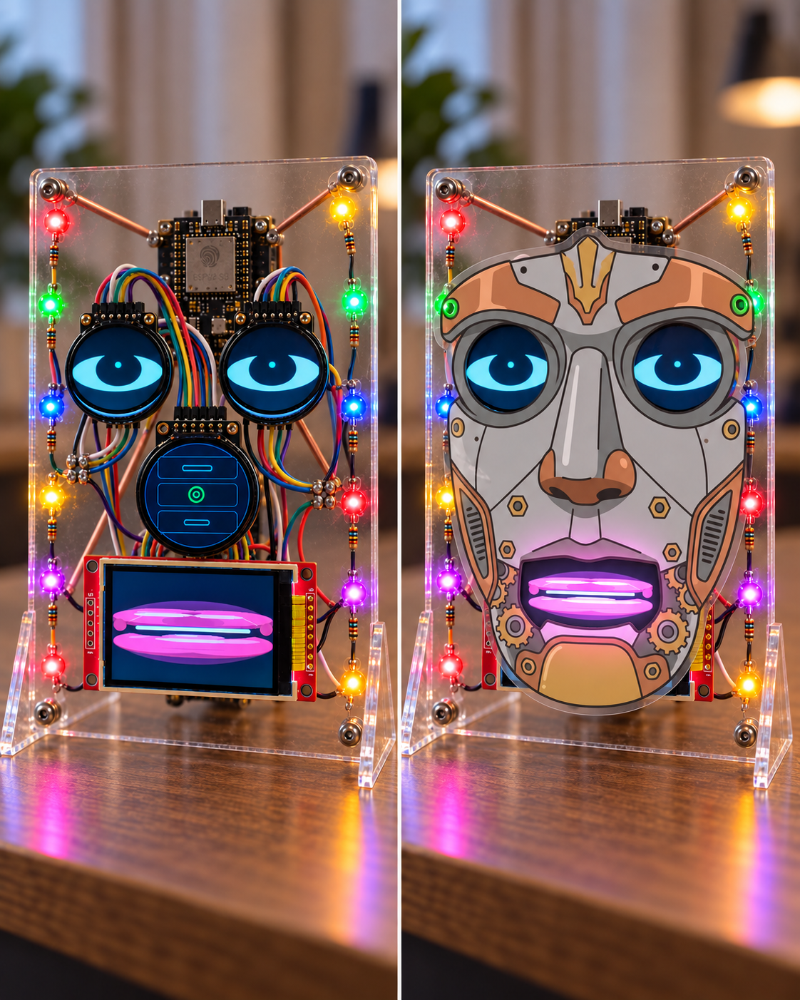

# One Body, Many Faces

Robot 790 does not need to hide his construction to become more legible. One
possible physical embodiment begins as an open little instrument: an acrylic
plate, copper supports, a proudly visible ESP32-S3, eye and mouth displays,
neat point-to-point wiring, and a string of LEDs. The electronics are part of
the face rather than the shameful machinery behind it.

The other half of the idea is deliberately simple. That same body can accept a
pre-punched paper or card mask: a child can color a new face onto it, then put
it over the eye and mouth hardware. Later, a painted or 3D-printed mask can
take the same role. The underlying instrument stays recognizable while the
visible character can change.

This is not a claim that a mask changes Eric's mind. It changes the body he is
speaking through. The software direction is the same: Eric asks for semantic
things such as gaze, speech, mouth motion, status, or a body action; the active
embodiment adapter decides how that intent becomes screen pixels, LEDs, or
physical hardware. Browser Face, an open acrylic rig, a masked face, and a
future mobile body can therefore be different expressions of one continuing
robot rather than forks of the character.

The images are concept art, not a wiring diagram or a finished build plan. The
pin map, power arrangement, display choice, and physical safety details belong
to the individual embodiment implementation when it is built.

- [Open-rig concept image](../media/generated-images/concept-embodiment-bare-rig-2026-09-09.png)
- [Removable-mask concept image](../media/generated-images/concept-embodiment-removable-mask-2026-09-09.jpg)
- [Creature Runtime And Embodiment Architecture](../creature-runtime-architecture.md)
