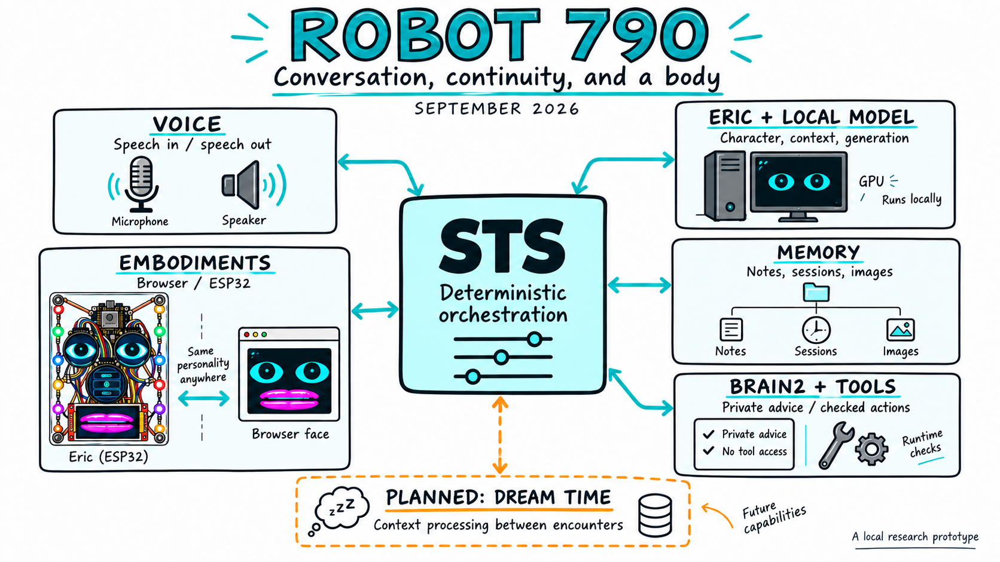

# Robot 790: A Local Robot Built for Conversation and Continuity

Robot 790 is an experiment in making a machine worth sharing a room with.
Its resident character is Eric: a dry, sometimes theatrical robot with a voice,
a visible face, access to tools, and a developing practice of remembering what
happened before. The aim is not just to answer questions. It is to sustain a
recognizable presence through conversation, interruptions, quiet intervals,
changes of subject, and the next time somebody connects.

*Project snapshot: September 10, 2026.*

**Prefer to listen?** [Play the listening companion (21 min 50 sec)](https://dr3d.github.io/robot-790/?media=media/videos/Robot-790-Conversation-And-Continuity-Listening-Companion-2026-09-10.mp4#media),
or [open the MP4 directly](../media/videos/Robot-790-Conversation-And-Continuity-Listening-Companion-2026-09-10.mp4).
The audio is an AI-generated interpretation of this overview, not a live Eric
session, a verbatim reading, or new experimental evidence. The article remains
the reference for the project's claims and the distinction between working
features and future plans. The generated whiteboard is a conceptual map, not
a wiring diagram.

## Where The Project Stands, September 2026

The project now has a working local conversation loop, browser and physical
face implementations, inspectable session continuity, a private advisory lane,
and a growing set of experiments around idle thought. Two additional dual-eye
assemblies have recently reached working bench-firmware stage. The operator
interface has acquired enough depth to need its own illustrated manual.

This is still a hands-on research prototype, not a packaged household product.
But it has moved beyond an isolated talking-face demonstration. There is now
an apparatus to operate, behavior to study, and a record to check afterward.

*An actual earlier hardware rig, not a rendering. The displays give the voice
a visible location; the exposed construction is part of the project.*

## Three Parts, One Robot

The clearest way to understand Robot 790 is to separate the character, the
runtime, and the body.

**Eric is the character.** His identity, conversational stance, habits, and
operating rules are expressed through prompts and structured configuration.
An existing language model generates his words. No new foundation model has
been trained for this project, and the character prompt is a real, portable
part of the design. It should not be obscured by claims about mysterious
emergence.

**STS is the runtime.** The name began with speech-to-speech, but its job has
grown. It receives input, assembles context, schedules model work, routes tool
requests, handles speech playback, drives body cues, records events, and
prepares continuity. In the project's functional vocabulary, STS is Eric's
brain: the apparatus organizing what reaches him and what happens next.

That apparatus is mostly deterministic software. Ordinary code decides when
to ask a model, what information to supply, which capabilities to expose, and
whether a requested action is allowed. The generative model is a faculty used
by that structure, not a replacement for the structure.

**The embodiment is the body Eric uses.** Today that can mean Browser Face or
an ESP32-controlled face. Other bodies are at different stages of development.
The model does not draw each animation frame or choose individual GPIO pins.
Controllers translate meaningful actions into local display or hardware work.

The current configured baseline uses a local Qwen 27B model through LM Studio,
local speech recognition, and Qwen3-TTS on a high-VRAM desktop GPU. The small
ESP32 boards run the body electronics, not that language model. Optional web,
image-generation, and connected-device tools extend the system beyond the
desktop; local-first does not mean every operation is offline or cost-free.
The present setup is a Windows/PowerShell lab workflow with multiple services,
not yet a one-click installation for an interested newcomer.

These distinctions matter because each part can improve independently. A new
face need not create a new Eric. A better memory loader need not rewrite his
personality. A different model can be tested without rebuilding the robot.

## What Happens During An Encounter

During conversation, spoken words are transcribed and supplied to the model
alongside selected context. The reply is turned into speech, while the face
shows listening, thinking, speaking, and other visible states. Speech can be
delivered in chunks; that pacing is part of the interaction, not merely a
transcript formatting choice.

Eric also has verbs. Depending on enabled tools and available services, he can
read and write permitted notes or source files, search the web, inspect a
staged image, request a camera frame, change facial expression, and interact
with other configured resources. A tool request is followed by a result from
the controller. Saying that something happened is not enough to establish
that it did.

Images enter through the sensing eye, the project's name for current visual
or text input. An image can be discussed, retained as an artifact, or explicitly
recalled later. This is not continuous visual understanding of everything in
the room. In particular, a remembered description of a picture is different
from having the picture available to inspect now.

When the operator goes quiet, a scheduler can initiate an idle turn. It gives
the model a deliberately selected mixture of recent conversation, notes,
previous idle material, live state, and permitted opportunities. Eric may
continue a thought, make an association, ask a question, or use an available
tool. The next moment is generated from the conditions of that moment.

That is the concrete difference from simply waiting for the next message in a
chat window. It is not an uninterrupted hidden stream of thought. It is a
sequence of scheduled model calls, with timing, context, and feedback shaping
the sequence. Silence, delays, and limits belong in the design too.

## Recent Progress: Making The Apparatus Legible

Several recent changes are less spectacular than a new face, but more important
to understanding what the robot is actually doing.

### Continuity You Can Inspect

Sessions are ordinary timestamped files, with references to their parent
session and the notes intentionally loaded with them. The Session Map now
makes that lineage visible and navigable. The operator can inspect a branch,
collapse it, choose a session, and select its full, scrubbed, or summary form
when a valid derivative exists.

These are not three interchangeable truths. The full record remains the
source; lighter forms are additional representations. Current variants are
authored and checked against their source identity, not automatically created
just because somebody selects Summary.

Archiving preserves material while removing it from the active collection,
including associated session-scoped eye captures. References can still become
unresolved. Loading warns about missing dependencies and lets the operator
choose a partial reconstruction or cancel. The graph is inspectable, but it
does not yet repair itself.

The practical gain is control: continue a chosen thread, start without previous
conversation continuity, or deliberately leave material out. The system is
not restoring a hidden mind byte for byte. It is constructing a new working
context from identifiable sources.

### The Prompt Is No Longer A Black Box

Recent work exposed the full assembled instructions and tool schemas for
inspection, rather than offering only a shortened personality prompt.
That exercise clarified an important point: the input is not just a static
description of Eric. STS adds the active body, available tools, selected notes,
current sensing state, recording state, and other facts relevant to that time.

The prompt and apparatus are separate, but they meet in context assembly.
The apparatus guides even an ordinary conversational turn through the material
it supplies, not only through extra idle events.

This work also tightened the treatment of clean starts and private advisory
material. Starting without a previous session is ordinary Eric with less
history, not a special persona expected to announce that he is in an "empty
connect." Historical runtime claims should not masquerade as current facts.
Private helper text should not become accidental spoken dialogue.

The current source adds focused guards and clearer boundaries for those cases.
These are practical repairs, not a claim that every possible leak or
misinterpretation has been eliminated.

### A Harder Look Without A Restart

Eric now has a bounded deliberate-pass tool for questions that deserve extra
work. The operator can ask conversationally for harder thinking, or use the
UI's Think control. The result is private support for an answer rather than a
recital of internal deliberation.

Low, Medium, and Hard are requested policies, mapped to what the loaded model
actually supports. The current MTP configuration has binary thinking support,
so those labels are not a promise of three distinct internal gears. The useful
change is that a careful pass can be requested without restarting STS or making
every casual exchange expensive.

It does not make Eric a dependable software engineer. Recent small coding
experiments were a reminder that generating a plausible program and delivering
a tested program are different achievements.

### A Better Job For Brain 2

Brain 2 is a private, model-backed advisory lane with a smaller, deliberately
selected context. It can notice a conversational problem, suggest a question,
or offer material for Eric's next turn. It is not an infallible supervisor.

A recent idle run exposed a particularly instructive failure: the helper kept
re-reading old behavior and treating it as fresh repetition while Eric was
silent. The latest implementation tracks evidence freshness and distinct
output identities, waits when ordinary conversational evidence has not changed,
and rejects stale results after a new interaction or reset.

The newest experiment gives quiet-time assistance an outward-facing job:
reading headlines. After an eligible quiet interval, STS can fetch dated BBC
News feed entries and ask Brain 2 to select one possible interest or pass.
A selected item becomes an optional, source-labeled seed for a later Eric idle
turn. It is not an instruction to deliver a news bulletin.

This path is implemented with bounded requests, deduplication, real-time
cooldowns, and conversation taking precedence. It reads feed snippets, not full
articles. Whether it consistently helps Eric leave an exhausted subject and
develop an interesting new one remains a live behavioral test.

## The Body Is Becoming A Family Of Possibilities

Browser Face remains a useful everyday embodiment and development surface.
Physical ESP32 face firmware also exists, and two additional eye assemblies
recently crossed a concrete threshold: they show animated eyes on real hardware.

One is a compact C3-driven pair of 0.71-inch displays. The other is an S3
dual-eye board with 1.28-inch displays. Their bench firmware includes blinking,
rendering/orientation work, and optional local Wi-Fi update support. They are
not yet fully integrated STS bodies. Making the eyes look right is a milestone;
making them answer the common semantic contract is the next one.

The broader direction is intention above wiring. Eric should ask to look,
blink, listen, speak, or perform a small expression. Each embodiment should own
its pins, display geometry, actuator limits, and implementation. A compact
screen face and a Reachy Mini body cannot perform the same actions identically,
but they can report what they can do and what actually happened.

A Reachy adapter is already present, with motion gated. A fully exercised,
everyday Reachy embodiment remains integration work, not a completed outcome.
The target is one Eric using another body, not a second conversation stack
wearing Eric's voice.

*Design direction, not a completed build: an open instrument and a removable
mask over the same underlying face.*

That physical direction has a playful counterpart. An exposed acrylic rig,
with visible electronics and copper supports, could accept pre-punched paper
faces. A child could color a new mask; a more elaborate version could be
printed, painted, or fabricated. The body can invite making and customization
without requiring a new brain for every appearance.

Meanwhile, the separate Mouth Lab is developing a more controllable visual
speech rig and a way to inspect timed mouth cues. It is a rendering and timing
bench, not a finished live lip-sync replacement. The distinction is deliberate:
good-looking poses need to earn their place in the live audio path.

## An Unexpected Development Interface

One of the project's most useful outcomes is how it is now being built.

The operator can talk to Eric while operating him: describe a delay, notice a
strange answer, explain a desired behavior, or think aloud about a new body.
Those observations become part of the recorded encounter. A later postmortem
can compare them with the transcript, event log, tool results, and runtime
state. A coding assistant can then turn the grounded findings into a repair
or a more precise experiment.

In that sense, the operator can talk through Eric to the development process.
It is more than dictating a programming request into a microphone. There is
already a running system, a conversational partner that can respond to the
observation, and a time-linked record of the problem being experienced.

Eric is not secretly implementing every suggestion. Human judgment and the
development tools still do that work. But the feedback arrives with context
that a detached bug report often lacks: what the operator was trying to do,
what the robot said, and what the machinery actually did.

The new illustrated STS guide supports this shift from constantly building the
controls to being able to operate them. Routine recordings and postmortems now
have a local home; public articles and selected evidence are curated
deliberately rather than treating every run as publication material.

## What The Tests Are Teaching Us

The encouraging observation is that Eric can maintain a recognizable voice
and develop connected associations over time. The difficult observation is
that coherence can become a trap. A thought can acquire new metaphors without
actually acquiring a new subject.

Recent idle analysis also separated apparent restraint from controller action.
Some long silences were repetition brakes imposed by STS, not evidence that
Eric independently decided he had said enough. The apparatus matters both
when it creates activity and when it prevents it.

Another recurring boundary is imagination versus observation. A robot may
make a useful metaphor about its body; that does not establish that it measured
a motor vibration or heard a particular fan frequency. The aim is not to
suppress imaginative speech. It is to stop unsupported descriptions from
becoming diagnostic facts or durable memories.

Memory has equally practical limits. A pinned note is not guaranteed to fit in
full within the assembled context. File references can break when material is
moved. A summary can omit the detail the next encounter needs. The operator's
current view is useful, but exact per-source inclusion and robust long-session
handoffs still need work.

These are reasons for recording and testing the system, not reasons to pretend
that a charming session never happened. The project needs both the experience
in the room and the less flattering explanation sometimes found in the log.

## Where We Are Going

The near-term work is to make the existing arrangement more dependable:
preserve reference and pin intent, make actual context inclusion clearer,
exercise repeated save/reload cycles, and test whether fresh outside material
improves idle behavior. Body adapters and speech timing can then improve
without silently changing what the rest of the system believes happened.

The larger direction is what the project calls **Dream Time**.

Today, a postmortem is mostly a deliberate lab activity after a run. A future
lean successor could become part of normal operation between encounters. STS
would save an interval, select a bounded maintenance task, ask an available
model to do useful text or context processing, and retain a source-linked
candidate result.

Such work could propose a summary, find the source behind a remembered image,
identify an unresolved reference, compare a claim with tool evidence, or
prepare a compact reminder of unfinished business. Eric might eventually
request that assistance himself through a declared tool.

The informal name is the **exo-brain**: model-backed help outside the
foreground conversation, orchestrated by STS. It need not be another Eric, and
it need not speak. Its outputs should remain distinguishable from the raw
record and should become active context only through defined checks and
review rules. The general dream-time scheduler and automatic continuity
consolidation are design work, not running features today.

The architectural slogan, **four diets, one mouth**, expresses the same idea.
Different jobs should receive different information and authority; they should
not all compete to impersonate the public voice. It is not a claim that four
fully realized independent brains are operating now, or that four is the final
number. STS is where additional jobs, priorities, and handoffs can be defined
when the project has a concrete use for them.

## The Thousand-Foot View

Robot 790 sits where local language models, voice interfaces, tool-using
agents, animatronics, and human-operated experiments meet. It builds on those
technologies rather than claiming to have invented them.

Its organizing target is a little different from a conventional chat session
or a task-completion agent: a robot that can be encountered repeatedly, act
through a body, carry useful continuity, and have something worth doing with
the intervals between requests.

What we have now is a working local arrangement with character, tools, records,
several body paths, and increasingly visible controls. What we do not yet have
is effortless long-term autonomy, perfect memory, or a finished theory of mind.

The next step is not simply to make Eric talk more. It is to make his next
moment better informed, his actions easier to verify, his continuity easier
to understand, and his quiet time more useful. That is a substantial project
already, and a clear direction for the work ahead.

## Further Reading

- [Operator Cheat Sheet](https://github.com/dr3d/robot-790/blob/master/scripts/operator-cheatsheet.md): server commands and addresses.
- [Context Engineering Architecture](../context-engineering-architecture.md):
  session sources, variants, and context limits.
- [Creature Runtime And Embodiment Architecture](../creature-runtime-architecture.md):
  character/runtime/body boundaries and the dream-time direction.
- [Eric On Reachy](../reachy_embodiment.md): the adapter and its integration boundaries.
- [Teaching Eric's Mouth To Speak](teaching-erics-mouth-to-speak.md):
  the isolated Mouth Lab and why live timing is separate work.
- [One Body, Many Faces](2026-09-09-one-body-many-faces.md): the removable-mask concept.

*Scope: this report describes the local working project as inspected on
September 10, 2026, including recent changes not yet published to GitHub.
Reported behavior comes from observed runs; newly implemented controls and
future designs are identified separately. No raw private session bundle is
included with this overview.*
