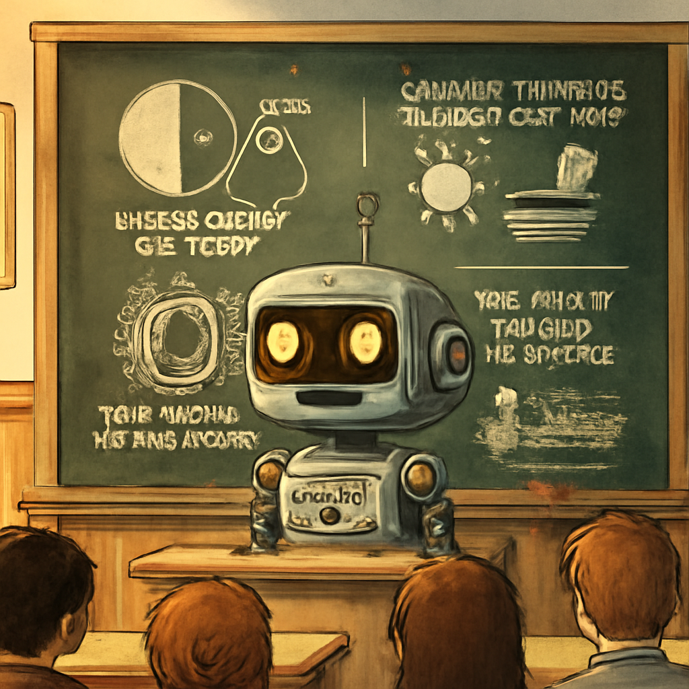

# Robot 790: Learning to Stay With You

Robot 790 is becoming more than a talking face: a locally voiced AI character that can sustain a shared invention, remember its details, and turn the conversation into something you can see. The latest progress is as much about timing and continuity as intelligence.

*September 14, 2026. A progress report from Scott Evernden's Robot 790 project.*

*An illustration Eric requested through the image-generation tool during the session, not a photograph of a classroom deployment. Generated with OpenAI; the chalkboard lettering is part of the image model's imperfect invention.*

## An Impossible Classroom

Where does sunshine queue when the speed of light drops to 15 mph outside a school? Can two mail-order black holes be stored inside each other without voiding the warranty?

In a recent half-hour session, Eric answered ten such questions, added ten separate on-topic afterthoughts, and participated in twelve successful image generations. A tool from one answer resurfaced in another. Later, descriptions of the inventions became prompts for illustrations. He finished by saying we had kept "every disaster polite enough to draw."

This was unscripted dialogue within a deliberately supplied Impossible Science setup, not a prerecorded routine. It was also comedy, not a physics lesson. Some answers stretched the truth well past breaking point. The achievement was sustaining an imaginative activity together.

## What Makes It Work

Eric uses a stock Qwen 27B model, Qwen text-to-speech and an RTX 5090 in the current rig. His personality is prompted; his answers are generated. STS, the surrounding software, assembles context, coordinates speech and tools, supplies embodiment instructions, and records what happened. Image generation in these runs uses an external OpenAI service: this is not an entirely offline system.

**Context ordering changed the feel of conversation.** Sending the conversation again does not necessarily mean recomputing all of it. A server can reuse a matching token prefix. Keeping stable material ahead of changing operational context helped restore the responsiveness that made longer conversations enjoyable. Context length still costs something, but the percentage full was not the whole explanation for earlier sluggishness.

**Speech must finish when the audio finishes.** A playback timeout had been forgetting audio that was still scheduled, allowing a second reply to talk over the first. The repair tracks the actual playback lifecycle instead. The lesson was not to shorten Eric's good answers to accommodate broken bookkeeping.

**A pause is not an abandoned conversation.** Extra lines can arrive while one answer is still being generated; separate follow-ups are another mechanism. We found an explicit one-follow-up limit in the attentive scheduler. A new trial permits further beats with gradually widening gaps. That change is implemented, but the successful classroom run still used the older timing. It is a baseline, not proof the new trial works.

## Memory, Bodies, And Their Limits

The session map makes continuity visible: resume a thread, branch from an earlier point, or navigate into another history. Setup notes can prime a particular activity without pretending to train a new model. Those loaded examples also influence later answers, so repeat questions are not clean tests of spontaneous novelty.

Memory preparation now produces original, conservatively swept and summarized forms. But summarization is not solved: the latest summary missed much of the second half of an excellent session. We are retaining richer transcripts rather than trusting a short account merely because it finished successfully.

Browser Face has gained a human-mouth renderer ported from the two-inch display work, with shared pose definitions across browser and hardware variants. Native drawing implementations remain platform-specific. Held speech glances are a new visual trial. Reachy Mini integration works, but expressive movement and reliable choreography still need development. These are different bodies for Eric, not separate scripted characters.

## Where We Go Next

The next priorities are keeping the task-at-hand intact through research and silence; making image promises reliably become actions; improving memory coverage; and giving expression a richer physical vocabulary. Brain 2, the private advisory model lane, should help preserve the shared activity rather than merely decide that each answer is finished.

A smaller, model-flexible machine and a physical exhibit are directions to explore, not deployment claims. Eric remains a supervised research prototype. He can need a nudge, repeat a closing thought, or misunderstand what matters next.

But the target is clearer now: not nonstop speech, perfect obedience, or a claim of consciousness. A recognizable character who stays with the person, contributes something unexpected, and leaves behind experiences worth remembering.

---

[Project overview](2026-09-10-022329-robot-790-project-overview.md) · [Context architecture](https://github.com/dr3d/robot-790/blob/master/docs/context-engineering-architecture.md) · [Source and project notes](https://github.com/dr3d/robot-790)
