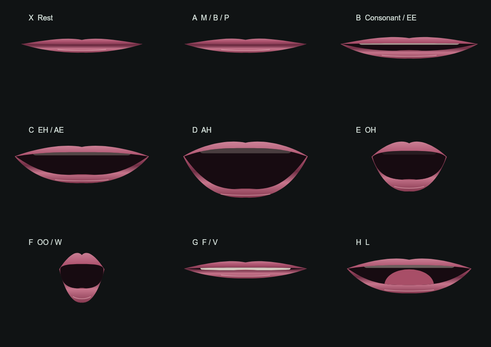

# Teaching Eric's Mouth To Speak



Eric already has a mouth. It opens while he talks. It can round, show teeth,
and settle into an expression. That is enough to make turn-taking visible, and
that alone changes the feeling of the conversation.

But it is not yet a speech animation system in the ordinary sense. The current
live mouth is closer to a good **speaking indicator**: speech begins, a few
coarse shapes are guessed from incoming text, and the face is told to look
alive. It can work socially while still being a poor account of what the audio
is doing at any particular instant.

The Mouth Lab is the first serious step from that indicator toward an
art-directable robot mouth. It is deliberately separate from Eric's live face.
Nothing in the lab changes the browser face, the voice, the S3 face, or a
running conversation. Its job is to let us see what sort of mouth is worth
building before we put it anywhere that matters.

In plain terms: the lab is a renderer-and-timing bench, not a live lip-sync
claim.

That separation is important. A mouth can look impressive in a still image and
still become distracting, late, unstable, or just vaguely wrong when it talks.
The lab gives us a place to find those failures cheaply.

## What We Have Now

The lab is three small things working together.

| Part | What it does | Why it matters |
| --- | --- | --- |
| A vocabulary | Defines nine visual speech targets: rest, lip seal, narrow consonant, open vowels, rounded lips, pucker, F/V contact, and L. | Many spoken sounds look alike. We need a compact visual alphabet, not forty tiny mouth drawings. |
| A rig | Separates jaw travel, mouth width, rounding, lip seal, lower-lip bite, tongue lift, teeth, and a small amount of expression. | A mouth is not one number called `open`. A closed lip can sit over a lowered jaw; an F/V can bring the lower lip to the upper teeth. |
| A time player | Plays authored silent studies or a local audio file with timed mouth cues. | We can stop, scrub, loop, slow down, and compare the same moment without a live conversation getting in the way. |

The result is a two-panel workbench. The left side shows the raw stepped cue:
one target, then the next. The right side uses the same cue track but renders a
continuous mouth. It eases between targets and can let width and rounding begin
a little early while keeping a lip seal intact.

That comparison is the whole point. It lets us ask a visual question without
changing five other systems at the same time: *does this transition actually
look better, or have we merely made it busier?*

The lab presently has three silent studies:

- **Contacts** puts short M/B/P seals, an OO/W pucker, F/V contact, and an L
  through their paces.
- **Rounding** checks how the mouth arrives at and leaves a pucker.
- **All shapes** is the inventory, one pose at a time.

There are controls for transition time, lip lead, jaw travel, lip volume, width,
and expression. They are audition controls, not personality knobs and not
claims about human speech science. They let us find a form that feels like
Eric's face before we automate it.

## The New Mouth Is A Rig, Not A Deck Of Cards

The first version of Eric's browser mouth uses several overlapping ellipses and
switches among a few topologies. That was a completely sensible first go: it
got a face talking quickly.

The Mouth Lab instead draws every target with one continuous outer lip contour
and one continuous mouth cavity. The rounded OO mouth is not a separate sticker
that appears over the normal mouth. It is the same surface becoming narrower,
rounder, and deeper. Teeth live in the upper jaw. The tongue remains inside the
cavity. The lower lip can lift toward the teeth for F and V.

Those details are small, but they stop the eye from seeing a pile of symbols
taking turns. The intended effect is not realism for its own sake. Eric should
still look like Eric: a designed robot with warm rose lips, a dark cavity, a
graphic silhouette, and enough life to make the voice feel located somewhere.

The nine current targets are a compact starting vocabulary:

| Cue | Visual job | Familiar sounds |
| --- | --- | --- |
| X | Rest | silence / neutral release |
| A | A real lip seal | M, B, P |
| B | Narrow, teeth-near consonant shape | many consonants, EE |
| C | Medium open spread vowel | EH, AE |
| D | Broad open vowel | AH |
| E | Rounded open vowel | OH |
| F | Puckered lips | OO, W |
| G | Lower lip meets upper teeth | F, V |
| H | Tongue-up glimpse | L |

This is a visual vocabulary, not a claim that speech has nine phonemes. Several
sounds share a visible configuration. Some important tongue work is hidden.
That simplification is useful: the viewer does not need a medical diagram of a
mouth. They need a believable robot speaking in time.

## The Problem We Found In The Live Face

The current live path has two clocks that do not know enough about each other.

```text
audio chunks -> scheduled on the browser audio clock -> speakers

text deltas  -> five-character guess -> latest mouth state -> Browser Face poll -> canvas
```

The text side attempts a new coarse mouth cue about every 90 milliseconds. The
Browser Face asks the controller for the latest state about every 250
milliseconds. In the time between two polls, several cues can arrive and be
replaced. The renderer may only see the last one.

```text
  0 ms         90 ms        180 ms       250 ms
  A closure --> F pucker --> C vowel ---> face sees only C
```

That is why simply making the canvas draw faster would not fix the feeling. The
information never reached it as a sequence. On top of that, audio is scheduled
on the Web Audio clock while the current cues follow arrival timing. Buffering
can make the mouth lead or lag the actual sound.

The live face does already have easing. The issue is more specific than "it
needs easing." Its rounded mouth currently switches into a separate drawing
topology, which bypasses normal easing, while an M/B/P closure is not a hard
physical constraint. The result can be a soft, delayed, or abruptly switched
gesture where a clear contact should have happened.

The Mouth Lab makes those individual faults visible. It is not yet connected to
the live route, precisely because the live route needs a better timing contract
as well as a better painter.

## What The Lab Does Not Do

It is worth being very plain about this, because the project has learned not to
promote an experiment into a claim too early.

The Mouth Lab does **not** currently:

- listen to Eric's live audio;
- recognize phonemes or generate its own cue timing;
- change the production Browser Face;
- make the physical S3 face speak differently;
- replace Eric's voice, model, or expression system;
- prove that the rendered mouth is synchronized with real speech.

The built-in studies are authored and silent. They prove that the new geometry
can make a pucker, a closure, an F/V contact, and a tongue shape without
changing the rest of the system. They do not prove that an actual sentence
will look good yet.

The lab can also accept a local sound file plus a matching JSON cue track from
[Rhubarb Lip Sync](https://github.com/DanielSWolf/rhubarb-lip-sync). In that
mode, its timeline follows the audio element's current position instead of
accumulating animation frames. That is a useful offline test path. It is not a
hidden online service, and it does not upload the recording anywhere.

## The Direction From Here

The path is deliberately staged. Each stage should earn the next one.

1. **Make one short Eric test clip.** Record a 10 to 15 second assistant-only
   line and keep its exact spoken text. Use sounds that exercise contact,
   rounding, and ordinary conversational flow.

2. **Generate and inspect timed cues offline.** Give the matching audio and
   transcript to Rhubarb, bring both into the lab, and watch the same line at
   full speed, half speed, silent, and audio-only. Correctness begins with
   looking and listening, not with a confidence score.

3. **Tune the robot performance.** Decide whether the best Eric has a little
   lip lead, how much jaw travel feels right, how full the lips should be, and
   whether the mouth stays readable at the small browser and S3 sizes. The
   goal is a face that has presence without demanding attention.

4. **Build a real timing channel.** A future live speech track should send a
   small timestamped cue sequence, tied to an utterance ID and the actual audio
   start time. The face should play that short track locally, rather than ask
   the server for a new single pose every few frames.

5. **Protect the live loop.** Interrupt, cancellation, reconnect, and page
   hiding must invalidate old tracks. If analysis is late or unavailable, the
   system should fall back to a modest audio-energy mouth motion rather than
   block speech or resurrect an interrupted utterance.

6. **Integrate behind a choice first.** The existing mouth should remain
   available while the new one is tested in actual sessions. Only then should
   we translate the same visual language into the S3's own constraints.

The eventual system does not need to be a giant facial-animation service. The
research points toward a compact, editable rig and a reliable time contract.
That is good news for Robot 790: it keeps the mouth understandable, tunable,
and native to the body rather than turning it into another opaque subsystem.

## What Success Looks Like

Success is not a human face that could fool a camera. It is quieter than that.

The lips close decisively for M, B, and P. The lower lip clearly finds the
teeth for F and V. Rounded sounds begin to gather shape before the sound feels
late. The mouth releases into a smile without reopening a necessary closure.
At normal conversation distance, the viewer feels that the voice belongs to
the face. At half speed, the animation has a readable structure instead of
random wobble.

And perhaps most important: after a few minutes, nobody is studying the mouth
anymore. They are listening to Eric.

The deeper technical account, source audit, cited research, and integration
constraints live in [Mouth Animation: From Pose Switching To Articulation](../mouth-animation-research.md).
The experimental source is in the [Mouth Lab directory](https://github.com/dr3d/robot-790/tree/master/web/mouth-lab).
