# STS UI Operator Guide

Updated: 2026-09-12. Screenshots: the local STS build on 2026-09-10.

This is the operating guide for the STS browser page: where to click, what
changes, what gets saved, and which controls deserve care. For addresses and
PowerShell startup commands, use the [Operator Cheat Sheet](../scripts/operator-cheatsheet.md).

The screenshots were taken in a separate, disconnected browser context. Blank
panes and disabled buttons are intentional. The displayed devices, sessions,
GPU readings, and dial positions are examples, not settings to copy blindly.
No microphone, camera, Eric conversation, or hardware action was started to
make these pictures.

## Contents

- [Quick Start](#quick-start)
- [Find Your Way Around](#find-your-way-around)
- [Connect Or Resume](#connect-or-resume)
- [Stop, Pause, Or Restart](#stop-pause-or-restart)
- [Microphone And Listening](#microphone-and-listening)
- [Show Eric Something](#show-eric-something)
- [Type, Think, Or Say](#type-think-or-say)
- [Record And Finish A Run](#record-and-finish-a-run)
- [Body And Voice](#body-and-voice)
- [Brain 2](#brain-2)
- [Idle And Lab Work](#idle-and-lab-work)
- [Memory, Pins, And Latest Thread](#memory-pins-and-latest-thread)
- [Session Map](#session-map)
- [Tools And Context Inspection](#tools-and-context-inspection)
- [When Something Looks Wrong](#when-something-looks-wrong)

## Quick Start

1. Start the realtime server and STS page server using the cheat sheet. Start
   Browser Face too if that is the embodiment you want.
2. On POWER, open [STS](http://127.0.0.1:8790/).
   Browser Face opens in a compact, resizable popup when you connect with that
   embodiment selected. The face server must already be running.
3. Open **Realtime Server > Connection Controls**. Choose **Connect** to
   continue the newest saved session, or **Connect Empty** for a new thread
   without a previous conversation note.
4. Wait for the header to say **CONNECTED**. Under **Eye And Mic > Mic
   Settings**, check the microphone. Under **Mic Controls**, press **Start Mic**
   and allow browser permission.
5. If recording matters, verify the **RECORD** pill actually says it is on.
   **Auto record** starts recording when the microphone starts, not merely
   when you connect.
6. Talk. Drop an image into **Sensing Eye** after connecting when you want
   Eric to see something. To run an idle experiment, check the Lab Run dials
   before leaving him alone.
7. Finish with **Disconnect**. Wait for the session-save and recording
   completion messages before closing the page, refreshing, or rebooting.

Connect Empty is ordinary Eric with a different starting context. It does not
select a special personality or remove the normal prompt, tools, and runtime
facts. The core memory note is included only when enabled and available;
browser-stored facts are a separate source. It is not a guarantee of literally
zero context.

## Find Your Way Around

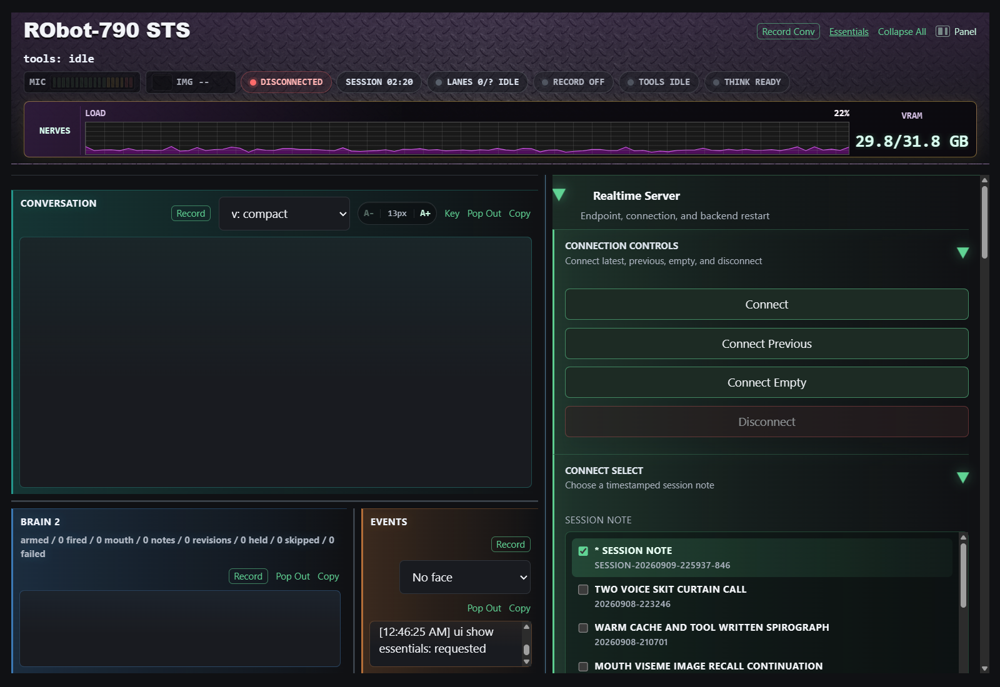

The left side is the run you are watching. The right side is the control
sidebar. **Panel** hides or restores the sidebar, **Essentials** opens the
common sections, and **Collapse All** folds the controls away. Click a section
heading to open or close it.

Drag the plain vertical divider to change sidebar width. The divider below
Conversation changes its height; the divider between Brain 2 and Events changes
their widths. Double-click a divider to restore its default position. Session
Map has its own dividers.

| Area | What to watch |
| --- | --- |
| Conversation | Your accepted words and Eric's spoken output. |
| Brain 2 | Private monitor work, candidates, advisories, skips, and failures. Not another conversation with Eric. |
| Events | Connection, tools, sensing, recording, scheduler, and error receipts. Start here when something behaves unexpectedly. |
| MIC | Incoming microphone level. Movement is not proof that STT accepted a sentence. |
| IMG | The current sensing-eye item. An empty indicator is normal after connecting. |
| Connection pill | Whether this page has a live realtime connection. A loaded model alone does not mean connected. |
| SESSION | The displayed session timer, not a model-performance measurement. |
| LANES / TOOLS | Backend work and tool activity. Useful while waiting for an answer. |
| RECORD | Actual recording status, distinct from the Auto record preference. |
| THINK | A requested deliberate pass and its outcome. Requested policy and actual model setting can differ. |
| NERVES | GPU load, VRAM, and CTX percentage. CTX is the latest completed B1 conversation request's input tokens divided by the configured context limit, not cache reuse or VRAM occupancy. It shows `--` until measured; isolated tool/idle calls do not replace it. Hover for token counts. High GPU load alone does not tell you which job is progressing. |

**Copy** copies a pane. **Pop Out** opens a separate text view. **A- / A+**
changes conversation text size. The Events filter changes the view, not the
underlying event record.

Conversation **Details** is off by default. Enable it to see image and text-note
recall receipts (IDs, filenames, and context handoffs). The preference also
applies to Pop Out and Copy. It does not hide Eric's spoken words or change his
context. Saved sessions, Record, autosaves, and PM evidence retain every receipt
regardless of this switch; no additional transcript file is needed.

The prosody selector changes the displayed input annotations, not Eric's voice.
**Key** explains them; in the compact notation, `q` is quiet, `m` medium, `l`
loud, and `p` a pause. Two timestamped Eric lines can be chunks of one response
split for speech delivery. They do not necessarily mean two model turns.

## Connect Or Resume

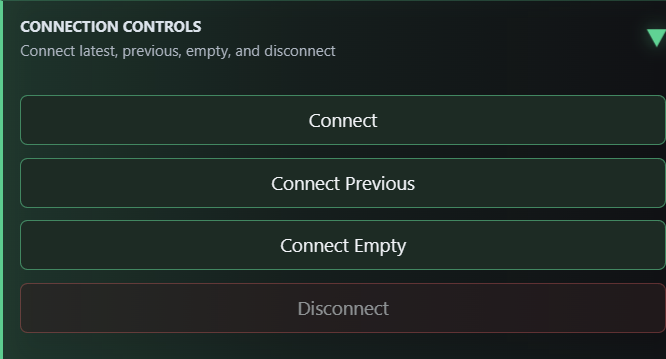

| Button | What it does |
| --- | --- |
| Connect | Starts a fresh realtime connection using the newest available timestamped session note. |
| Connect Previous | Chooses the earlier timestamped session relative to the current one. The newer note remains on disk. This is not the Session Map's lineage-parent button. |
| Connect Empty | Starts without a previous conversation note or its inherited pinned-note set. Current sensing-eye and transient run state are cleared. The optional core note is still eligible. |
| Disconnect | Stops Eric's speech and automatic work immediately, stops the mic, saves accepted conversation into a session note, closes the connection, finalizes active audio, and saves pane snapshots. It leaves the servers and loaded model running. |

The normal Connect buttons clear the sensing eye. **Connect first, then drop
the picture.** A historical note saying an image existed is not a live image.

A connection with no accepted conversation lines does not create a useful new
session note. If Disconnect reports a save failure, Eric stays stopped and the
transcript remains in the browser. Inspect the specific error in Events, fix the
missing dependency or service problem, then press Disconnect again. Do not
refresh an unsaved failed-stop session. The socket can remain open for the retry;
that does not mean Eric is still running.

### Choose A Particular Session

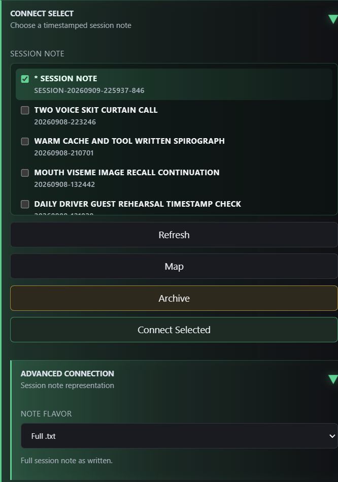

1. Open **Connect Select** and press **Refresh** if necessary.
2. Check the session you want. The checkboxes are an exclusive selection, not
   a request to load several sessions together.
3. Leave **Advanced Connection > Note Flavor** on **Auto history** for the
   current all-swept history policy. Choose **Full .txt**, **Scrubbed**,
   or **Summary** explicitly for a single-session form experiment.
4. Press **Connect Selected**. Do not press ordinary Connect when you mean to
   load your highlighted choice.

The asterisk marks the current session entry reported by the server; your
highlight is a choice you can inspect before connecting. A missing variant
cannot be selected, and selecting Summary does not run an LLM to create one.
Auto history does prepare missing or outdated generated forms before connecting.
It never silently substitutes the full transcript. A new thread starts with
Connect Empty; after Disconnect saves it, ordinary Connect resumes using Auto.
All retained saved sessions currently use swept text, including older ones.
`config/runtime.json` has `context_history.use_summaries: false`; summary drafts
are still generated but not loaded by Auto. The experimental recent-swept/older-summary
window applies only when that switch is enabled, using `recent_swept_sessions`.

If loading finds missing referenced notes, read the preflight warning. Cancel
to fix the dependencies, or proceed with the available context knowing what
will be absent. A partial load is not the same as complete restored memory.

## Stop, Pause, Or Restart

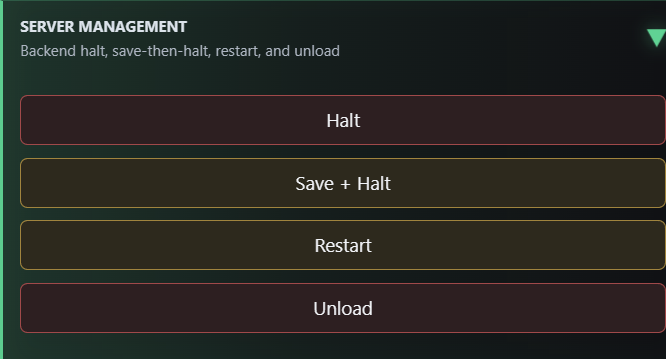

These are different operations, despite living next to one another.

| Control | When to use it | Important distinction |
| --- | --- | --- |
| Disconnect | End an ordinary sit-down and preserve it. | Saves continuity; leaves the backend and model available. |
| Save + Halt | Explicitly save and stop Eric's current browser run. | Stops activity before saving, then closes the connection. A failed save stays stopped and is retryable. It does **not** kill the realtime server process. After a successful save the button becomes **Start Eric**. |
| Start Eric | Resume after a saved halt. | Loads saved continuity and reconnects. Check/start the mic afterward; see the resume caveat below. |
| Halt | Stop the realtime backend process. | Not a substitute for saving continuity first. |
| Restart | Relaunch the realtime backend using the selected brain configuration. | Interrupts the run and can reload the model. Save/disconnect first. |
| Unload | Stop the backend and release the LM Studio model/VRAM. | Not an ordinary conversational pause. Save/disconnect first. |

**Resume caveat:** Start Eric uses a different path from the normal Connect
buttons and does not perform their full fresh-context/sensing-eye reset. Use
Connect or Connect Selected when you want that clean reset; do not assume the
resume shortcut cleared the eye.

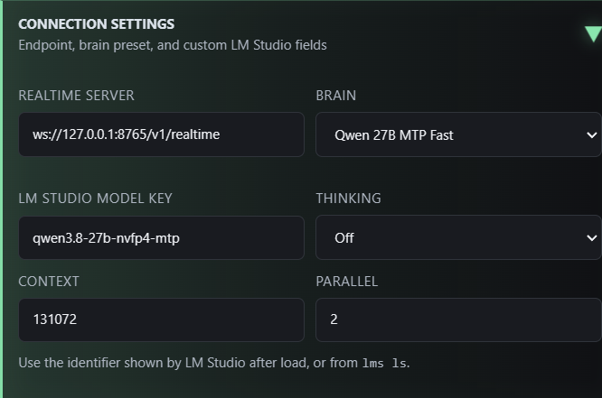

**Connection Settings** contains the realtime WebSocket address, Brain preset,
and custom LM Studio fields. These configure the backend launch. They are not
the one-turn **Think** control. Leave a working brain configuration alone for
ordinary conversation; changing it is a deliberate server-management task.

On another apartment device, use the HTTPS gateway addresses from the cheat
sheet, not POWER's loopback address. The gateway is a separate service. A
reachable page, a reachable realtime server, and a trusted browser microphone
origin are three different requirements.

## Microphone And Listening

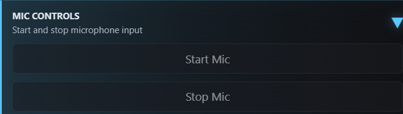

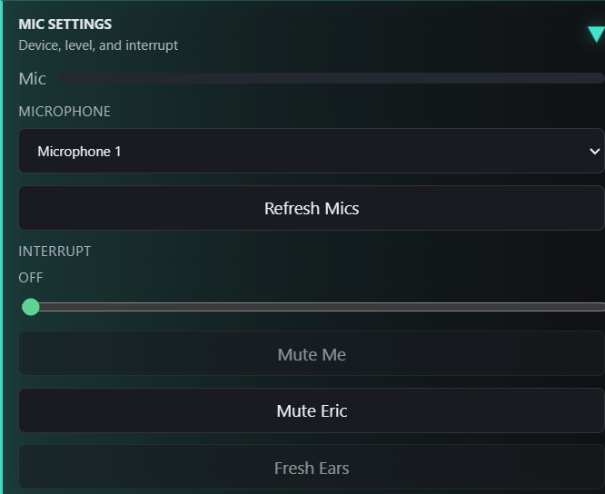

| Control | Use |
| --- | --- |
| Start Mic / Stop Mic | Start or stop the selected browser microphone stream. Stopping it does not disconnect Eric or stop idle thinking. |
| Microphone / Refresh Mics | Choose an input device; refresh the list after plugging in or changing devices. Changing devices while listening restarts the mic path. |
| Interrupt | Adjust microphone interruption sensitivity. Off (zero) disables browser audio barge-in and backend speech-triggered response cancellation. |
| Mute Me | Keep your microphone out of Eric's input while retaining it in an active recording. Useful for operator narration, **not** a privacy mute for the recording. |
| Mute Eric | Silence local Eric playback. His generation and recording continue. |
| Fresh Ears | Restart the microphone path with fresh input buffers after a capture/STT problem. Not a memory reset. |

Changes take effect while connected. Ending image-tool protection does not
override Off. The mic still accepts input, and explicit Disconnect/Stop still
cancels work; Off is not microphone mute.

Microphone interruption now requires sustained amplitude with a minimum RMS
level while Eric's audio is actually playing. A single peak or queued audio alone
cannot trip this browser path. This is not speech recognition and cannot guarantee
that sustained room noise will never interrupt. `audio_interrupt` in
`config/runtime.json` supplies `minimum_active_ms` (200), `maximum_gap_ms` (100),
and `minimum_rms_ratio` (0.12 relative to the sensitivity threshold). Refresh while
disconnected after changing these settings. Events records the effective values
and logs sustained interruptions with duration, peak, RMS, and playback state.

For a mic problem: confirm Connected, select the intended device, check browser
permission, Start Mic, and watch the meter. If the meter moves but words do not
arrive, check Mute Me, try Fresh Ears, and inspect Events. Avoid resetting the
whole conversation as the first microphone repair.

## Show Eric Something

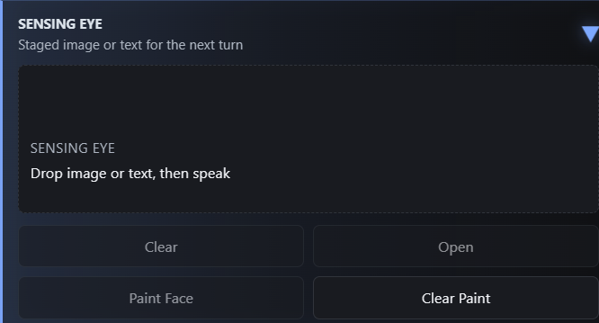

**Sensing Eye** stages an image or supported text for Eric's next interaction.
Drop the item, wait for its name/preview, then speak or send a typed question.
This gives your question an explicit object: "What do you notice in this?"

**Open** inspects the current item. **Clear** clears the live eye; it does not
promise to erase saved captures or historical mentions. **Paint Face** uses
the image for Browser Face's appearance, while **Clear Paint** removes that
paint. Face decoration and what Eric is currently seeing are separate states.

You can also ask Eric to reopen a saved picture by description. A catalogue
lookup is not itself a recall: STS gives him one text-only selection step with
the returned file IDs, then lets him speak from the actual recall result. If he
cannot identify it, he can ask which picture you mean. Saved remarks help locate
an image; they are not a substitute for opening and inspecting it.

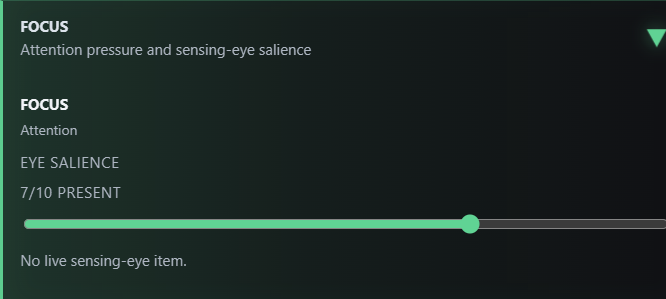

Under **Robot Controls > Focus**, **Eye Salience** controls attention guidance
and preview opacity. It is not timed forgetting, a deletion control, or a
measurement of the model's attention. A zero setting is meaningful even if the
picture still exists in the run's records.

### Camera And Mirror

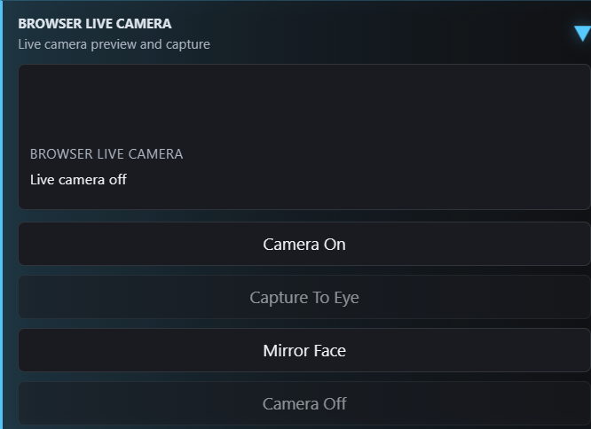

**Camera On** opens a browser camera preview after permission. **Capture To
Eye** takes a frame into the sensing eye; **Camera Off** closes the preview.
Turning the camera on is not, by itself, continuous video understanding.
**Mirror Face** stages a one-shot capture of Browser Face so Eric can inspect
his rendered appearance.

### Generated Images

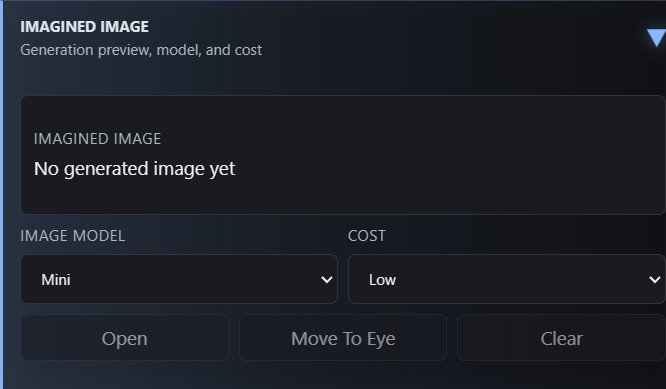

**Imagined Image** shows the latest generation. **Image Model** and **Cost**
configure that tool's model/quality policy; they do not generate an image just
by changing a selector. Image generation can use a paid external service.

Use **Open** to inspect the result and **Move To Eye** to let Eric see it.
Generating a picture and seeing that picture are separate steps. **Clear**
clears the displayed generated-image state, not an instruction to delete every
saved copy.

## Type, Think, Or Say

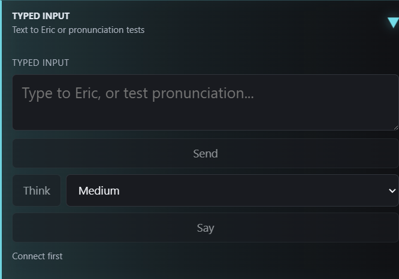

| Button | What the typed text means |
| --- | --- |
| Send | A normal user message to Eric, without needing the mic. |
| Think | An ask with one bounded private deliberate pass at the selected Low, Medium, or Hard policy. |
| Say | Text to speak through Eric's current voice, without adding a normal user question. Useful for pronunciation/delivery tests. |

The Think policies are requests, not a claim that every model has three
different internal reasoning levels. The controller maps them to supported
settings and the pill reports the actual result. The current MTP configuration
has binary thinking support. A deliberate pass does **not** require restarting
STS or permanently changing Eric's normal conversational setting.

You can also ask Eric conversationally to take a harder look. The tool is
available to him; the button is a lab shortcut, not the only way to request it.

## Record And Finish A Run

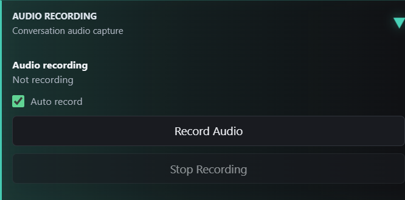

There are three distinct kinds of saving:

| Action | What it preserves |
| --- | --- |
| Header Record Conv | Text snapshots of Conversation, Events, and Brain 2. It is not the audio recorder. |
| A pane's Record | A text snapshot. Conversation includes recall receipts even when Details is off. |
| Record Audio / Stop Recording | The conversation audio and associated run evidence, finalized through the recording pipeline. |
| Disconnect / Save + Halt | A continuity session note, plus exit snapshots and finalization of active recording. |

**Auto record** starts audio when the mic starts. For a typed-only or idle-only
test, explicitly check recording state and start recording when wanted. Brain
2's optional browser-synthesized monitor voice may be audible in the room
without being present in the main MP4.

For a useful postmortem:

1. Check the recording state and lab settings before the experiment.
2. Say your observations to Eric as they occur. Those observations become
   timestamped evidence alongside what he actually did.
3. End with Disconnect, or Stop Recording if you are continuing the session.
4. Wait for the saved artifact link and Events receipts. Finalization can take
   time after speech has stopped.
5. Ask for the PM of that run. Saving a run does not itself write the editorial
   postmortem or publish anything to GitHub.

Do not use browser refresh as a stop-and-save button. If saving fails, keep the
page open and inspect Events. Routine raw evidence and PMs are local; selected
material is deliberately curated for publication.

## Body And Voice

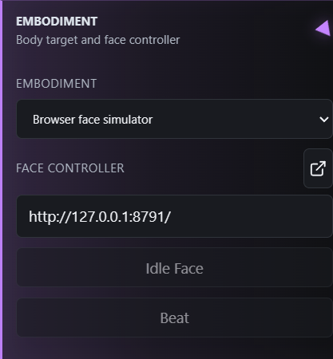

**Embodiment** selects the body profile and face controller address. Browser
Face, physical face controllers, and Reachy Mini are different targets; choosing
a name does not start that device or make unavailable capabilities appear.
STS remembers the face controller in this browser across refreshes. Connect,
Connect Empty, Connect Previous, Connect Selected, and Start Eric open or reuse
a compact Browser Face window when it is the selected embodiment. Reconnecting
does not resize an already-open window. A hardware embodiment does not open it.

The **Open Browser Face** arrow beside the face controller label opens or focuses
that window without changing Eric's embodiment. Use it to reopen a closed window
or retry after allowing popups for STS. Connections requested through Session Map
may need this manual step because the browser may not carry the click permission
between windows. This opens the display, not a server or a new conversation.
Eric's **set_embodiment** tool still switches controllers; it does not open windows.

**Idle Face** sends a neutral/idle face action. **Beat** sends a test expression.
These are real controller actions, not preview-only buttons.

**Chassis** has a controller address and **Stop** command. The Advanced chassis
tool switch controls whether Eric receives that tool capability. Check the
physical environment before enabling or testing motion.

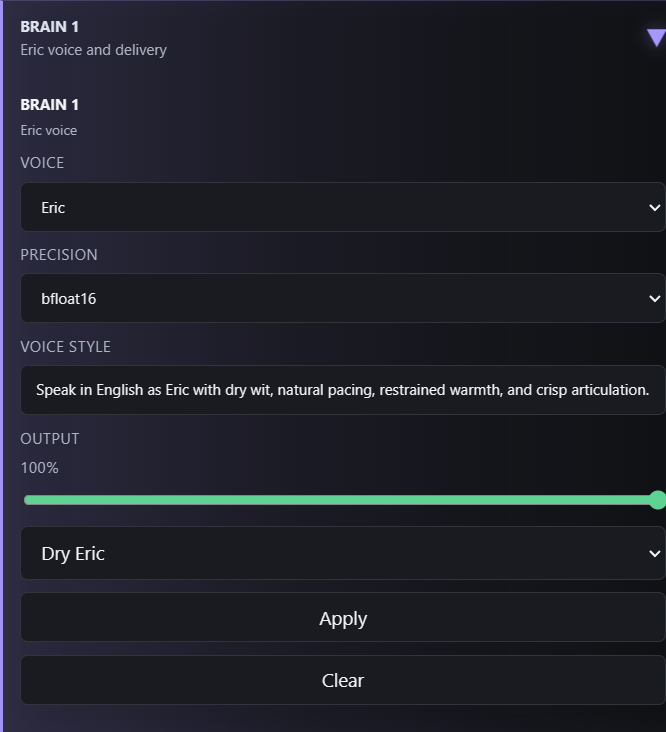

**Brain 1** holds Eric's TTS voice, precision, delivery style, and output level.
Use the style controls and **Apply** to update delivery. A voice/style change
is not a new creature prompt or a new conversation memory.

> **Watch the Clear button here.** In this build it clears the hot conversation,
> Events, Brain 2 scratch state, and related run ledgers. It is not "clear voice
> style." Save the run first. It also is not a guaranteed wipe of the backend's
> already accumulated conversation.

## Brain 2

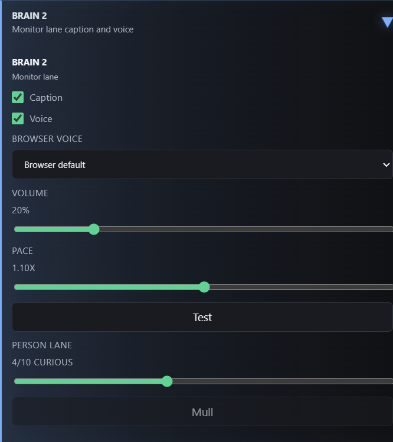

**Caption** enables the Brain 2 monitor lane in this build. Despite the name,
it is more than a cosmetic caption toggle. **Voice** optionally reads surfaced
monitor lines through the browser's speech synthesis. Browser Voice, Volume,
Pace, and **Test** affect that monitor voice, not Eric's main TTS.

**Person Lane** changes how strongly the ordinary observer pass studies the
operator. **Mull** requests a manual private pass. It is different from
**Ponder**, which requests an Eric idle turn.

Brain 2 uses bounded context, not an independently retained full conversation.
Its ordinary automatic observer waits for fresh conversational evidence;
repeatedly analyzing unchanged text is not the goal. Candidates and eligible
private advisories can inform Eric. A surfaced monitor line is not necessarily
a spoken Eric response, and a logged suggestion is not proof that he used it.
Normal isolated idle requests now include the actual bounded advisory snapshot,
not just instructions describing Brain 2. Performance and substrate experiments
keep their private-context exclusions. Current body and sensing-eye facts remain
separate from historical dialogue; remembering a picture does not reload it.
The `steering` log records B2's structured loop/grounding assessment and proposed
next step. These are private judgments, not sensor receipts. A new-subject
proposal can select an unused cached headline without another feed request.

The headline job is a separate use of Brain 2 during quiet. It can run with
Person Lane at zero when the other headline conditions are satisfied.

With Reachy Mini selected and face tools enabled, the same observer can suggest
an occasional nonverbal gesture instead of a mouth caption. No extra model call
is added. The controller rejects stale or conflicting suggestions, respects explicit
gesture/gaze holds, and allows at most one attempt per 30 real-time seconds,
even at high Lab Speed. A cue blocked only by Eric's own playback may wait up to
15 real seconds and is rechecked before use. The Brain 2 log shows `body cue
deferred`, `accepted`, `dropped` with a specific reason, or `failed`; acceptance
is not completion. Requested gesture followups now wait briefly for verified
completion when the body supports it. See the
[Reachy cheat sheet](reachy-cheat-sheet.md) for its repertoire and direct test.

## Idle And Lab Work

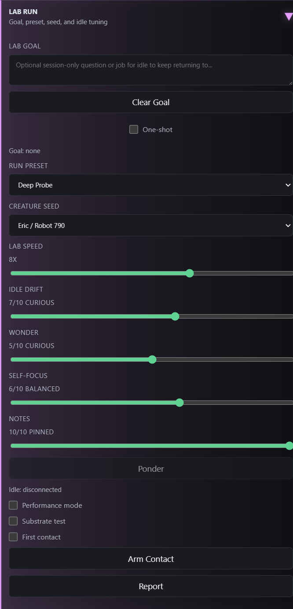

These controls change experimental conditions. Record the settings, then change
one thing at a time when comparing runs.

| Control | Meaning |
| --- | --- |
| Lab Goal | A session-only question/job for idle to return to. Clear it for a free-wandering test. |
| One-shot | Treat the goal as a job for the next response, then clear it. |
| Run Preset | Apply a bundle of lab settings. Inspect the resulting dials afterward. |
| Creature Seed | Select an identity experiment. Keep Eric / Robot 790 for ordinary Eric testing. |
| Lab Speed | Compress eligible scheduler waits. 12x is not twelve times the model's token-generation speed. |
| Idle Drift | How readily idle thoughts surface and the associated register. Zero disables ordinary drift; 11/12 are deliberately overactive. |
| Wonder | Curiosity and lookup pressure. It neither changes LLM temperature nor guarantees a search. |
| Self-focus | Bias idle attention toward inward/body/self material or outward subjects. |
| Notes | How strongly loaded notes shape idle. It does not pin/unpin files or resize model memory. |
| Ponder | Request an Eric idle turn now; useful for a spot check, but not required for a timed run. |
| Idle status | The scheduler's explanation: waiting, firing, disconnected, busy, blocked, and so on. |
| Performance / Substrate / First contact | Specialized lab conditions, not prerequisites for Connect Empty. Leave them off for an ordinary idle run. |
| Arm Contact / Report | Arm the first-contact experiment, or export the lab report. Not normal conversation controls. |

Check Lab Speed at the start of every test. The page's one-time operator
defaults can apply Deep Probe at 8x, as in this screenshot; the normal reload
path resets speed to 1x. Do not infer your current settings from an old picture.
Some protections and external-work cooldowns intentionally use real time even
at high lab speed. A Brain 2 hard brake can still pause idle speech.

For ordinary conversation at Drift 1-10, pauses now start with a shorter idle
interval: roughly 12 seconds after a short reply finishes playing, gradually
stretching toward the normal Drift interval over three minutes without new
operator input, measured after his direct reply finishes. Early thoughts invite
continued shared activity. One automatic conversational beat is allowed per
operator turn; afterward Eric leaves room for an answer until the attention
window fades. A new utterance immediately opens that opportunity again. These
beats use the latest exchange, not the independent-idle research scaffold.
Autonomous idle speech does not renew that attention. The old separate
check-in timer is not used in this mode. A silent connection still uses normal
idle timing, and Drift 0 remains off. Use **Lab Speed 1x** to feel the transition;
there is no additional switch to enable it. Specialized lab modes and Drift
11/12 keep their existing behavior.

Timing experiments live in `config/runtime.json` under `idle_timing`, not extra
UI dials. The [attention timing reference](context-engineering-architecture.md#conversational-attention-ramp)
lists the defaults and how the guards interact. Refresh while disconnected
after a config edit; the Events pane records the effective timings. No server
restart is needed for subsequent timing-only edits.

### Try The Idle Headline Path

1. Refresh to the current UI build before connecting, then Connect Empty or
   resume the thread you mean to test.
2. Enable **Brain 2 > Caption** and **Advanced > LLM web search**.
3. Keep **Idle Drift** and **Wonder** above zero. Set **Lab Speed** to 12x for
   your accelerated observation run. For outward wandering, lower Self-focus
   rather than treating high drift as the only useful dial.
4. Leave Lab Goal blank and Performance, Substrate, and First contact off.
   Active self-tasks can also defer the headline job.
5. Leave the run quiet for at least two real minutes, and observe for 10-15
   real minutes. Busy speech, tools, or model work can postpone the opportunity.
6. Look in Brain 2 for `headlines fetch`, `headline selected`, `headlines
   passed`, or `headlines unchanged`. Events can show `idle headline seed
   ready`; a later idle turn can use the `headlines` lane.

The source is the configured BBC News RSS path in this build. Brain 2 may choose
one dated story as an optional private seed or pass on the batch. This is not a
command to read headlines aloud, nor evidence that Eric read the whole article.
The first quiet threshold is two **real** minutes and the retry cooldown is ten
**real** minutes, including at 12x. Normal conversation takes precedence.

A newly selected headline arriving after a hard loop brake can permit one
bounded idle beat. The brake stays armed, and the seed is consumed once; old,
expired, or already-delivered seeds do not release it. User activity, active
goals/self-tasks, ordinary cooldowns, and busy model/tool work still take priority.
This is an opportunity to change subject, not a guarantee that Eric will use it
well. It does not speed up feed polling.

On your return, the prompt preserves the most recent completed quiet interval
through follow-up questions, with retained counts and the latest receipt. Feed
headline selections are counted separately from controller web searches. Neither
count establishes that Eric read a full article or mentioned it aloud.

No separate provoke-headlines button is needed for this test. A successful
fetch and a good spoken change of subject are separate things to evaluate in
the PM; a repetition brake can still prevent the latter.

## Memory, Pins, And Latest Thread

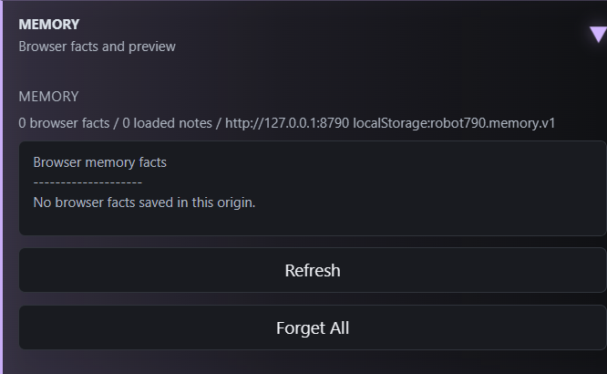

**Memory** shows browser-stored facts. **Refresh** refreshes that view.
**Forget All** removes those facts, not all note files or session history.
Browser facts are origin-specific: `127.0.0.1`, `power`, and an IP address can
have different stored settings and memories.

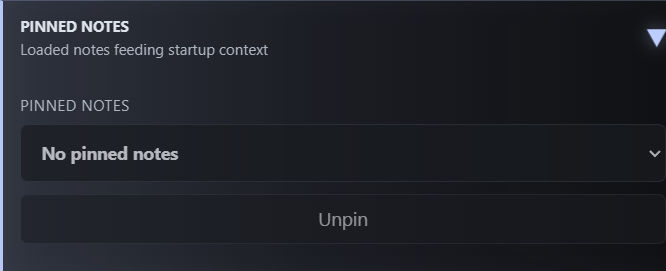

**Pinned Notes** lists loaded note sources feeding context. **Unpin** removes
the selected source from the loaded set; it does not delete the file. A session
can reference earlier notes for rehydration. A selector entry is not, by itself,
a claim that the whole session list is pinned into Eric.

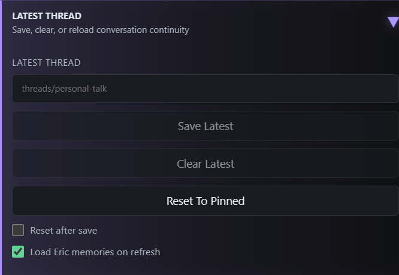

| Control | Effect and caution |
| --- | --- |
| Filename field + Save Latest | Write the current conversation as a note at the requested name. Use a distinct filename when preserving another version; this is a write, not just a preview. |
| Reset after save | Follow the save with a hot-context reset. Leave off unless that is the experiment. |
| Clear Latest | Clear the live thread; when connected, also use the reset/reconnect path. Save first. |
| Reset To Pinned | Clear hot conversation/idle/B2 state and reconnect if connected. See the implementation caveat below. |
| Load Eric memories on refresh | Allow the configured core memory note to load. The file must actually exist; a checkbox cannot restore a missing file. |

**Spoken note requests:** "Save these ideas as puppet.txt" or "Summarize our
Gulu Gulu plans" asks Eric to compose a focused note in his own words. It does
not ask for the whole transcript. Say "Save the verbatim transcript as
puppet-transcript.txt" when that is what you want. Missing authored text no
longer silently falls back to a conversation dump. Save Latest and automatic
Disconnect session saves still preserve transcripts; they are separate paths.

This default is not a complete file-workflow repair: approval of an offered save
can still be rejected by the current write gate, and read-to-write tool
continuations still need the reliability work documented in the task-continuation
experiment. A successful write receipt remains the evidence that a file exists.

If Connect reports a missing startup note, the configured core file is
`notes/core/erics_memories.txt`. Restore that file from your retained copy, or
uncheck **Load Eric memories on refresh** here to intentionally connect without
it. The error names the file and this setting. STS does not silently substitute
an empty memory note when a requested file is missing.

**Current reset caveat:** Reset To Pinned and connected Clear Latest call the
ordinary connection loader after clearing scratch state. That loader rebuilds
notes from current continuity; it does not reliably preserve an arbitrarily
hand-edited in-memory pin set. For a controlled reload, save first, Disconnect,
and explicitly choose Connect Empty or Connect Selected. Do not use this label
as proof of exactly which notes survived; check Context Map afterward.

## Session Map

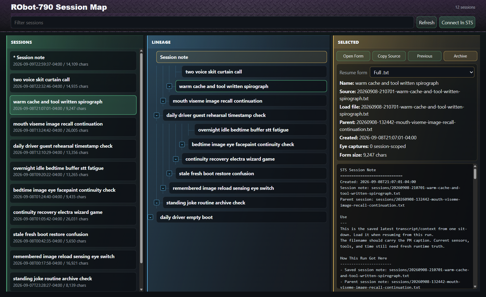

Open **Map** from Connect Select. The left pane is the session list, the middle
is lineage, and the right is the selected note and available representations.
Selecting a row or node previews it; that alone does not replace Eric's context.

The tree grows upward: older ancestors are toward the bottom and newer
descendants above them. Use the **+ / -** junction controls to expand or
collapse branches. Drag the two dividers to give the pane you are reading more
width; double-click to reset a divider.

Each lineage has a bright color edge and a restrained tinted fill. The map uses
a twelve-color spectrum before repeating a family color, and retains assigned
colors during live refreshes. Roots are darker; descendants use lighter
variations of the same hue. The left-hand session list uses the exact same
tints, even for sessions inside a collapsed branch. The gold current-session
border and green selection outline keep their meanings. On opening the map, older branches are
collapsed and the path to the newest session is expanded. Refresh preserves
manual folding; a newly arrived session reveals its path. Selecting an older
session reveals its ancestors. Filtering temporarily reveals matching branches
without changing the unfiltered map's folding choices.

| Control | Meaning |
| --- | --- |
| Filter sessions | Narrow the visible session list. |
| Refresh | Read the current session inventory again. |
| Resume form | Auto history previews the prepared load plan; Connect prepares missing forms. Full .txt, Scrubbed, and Summary remain explicit single-session alternatives. |
| Prepare forms / Retry preparation | Queue a conservative semantic sweep and a fact/gem/feedback summary using local Qwen. Originals and reviewed forms are preserved; obsolete generated forms can be upgraded. |
| Open Form | Open an explicit representation through the note-reading endpoint. Disabled for Auto, whose multi-note preview is in the selected pane. |
| Copy Source | Copy the source filename, not the entire note text. |
| Previous | Select this node's lineage parent. Unlike Connect Previous, this follows a relationship, not merely date order. |
| Connect In STS | Ask the originating STS window to connect with the selected note and representation. Disconnect an existing conversation first. |
| Archive | Move the selected session and its associated session-scoped eye captures out of the active collection, after confirmation. |
| Archive Branch | Preview the selected session and all active descendants, then confirm the listed batch. Other branches and shared assets they use remain available. Disconnect first. |

Open the map from STS when you intend to use Connect In STS. A standalone map
without its originating window cannot directly control that window and falls
back to copying the chosen load path.

### Ask Eric To Enter A Session

With note/file tools enabled, these maintenance requests are also available:

- "Show me the session map." Eric receives up to 12 titles, dates, exact IDs,
  and parent links per page, not entire transcripts.
- "Find sessions with rehearsal in the title." The catalogue supports title
  and filename substring filtering, not semantic search inside old transcripts.
- "Enter session Genius of the Universe Rehearsal." An exact unique title or
  exact session ID selects the destination. Duplicate titles need an ID/date
  clarification. Partial names do not automatically select a near match.

Listing does not change context. Entering queues a real transition: finish the
current response and queued speech, save and disconnect this conversation, then
use the existing Connect Selected path with the current Note Flavor setting.
The departed run is saved on its original branch. New conversation continues
from the selected destination; it does not carry the departed run along as a
new parent. The sensing eye clears normally. If the mic was running, STS starts
it again after connecting and preserves the UI narration-mute state. A typed-only
session keeps the mic off. Recording finalizes on departure; ordinary Auto record
behavior applies when the mic restarts.

The first version switches directly for an exact destination requested through
the tool, without an extra confirmation dialog. Existing missing-reference
warnings may still ask for confirmation. New user activity or Disconnect before
departure cancels a pending move. Failed saves prevent loading the destination;
keep the page open and retry Disconnect as usual. A failed destination load or
connection leaves the departed session saved. Check Events for `session map
arrived` or a specific failure. A queued tool receipt is not proof of arrival.

Eric is instructed to use this only for an operator-requested thread change.
Navigation tools are excluded from idle's tool list, and runtime checks reject
autonomous-lane moves. STS does not use an English keyword test to interpret the
request; the model selects the verb, and code validates identity and lifecycle.
If Eric first needs to look up a vague destination, expect a clarification and
then another instruction to enter the named session. This is not yet a general
multi-step autonomous navigation agent or an archive-restoration tool.

Reload STS while disconnected to get build `20260912-session-map-navigation`.
This introduces tool descriptions and receipt-follow-up instructions, not a
personality rewrite. Existing root full-prompt snapshots predate these verbs.

Archive remains session-only; Archive Branch follows parent links, not pinned
note references. The server rechecks the preview before moving anything. If the
branch changed, preview it again. At least one active session must remain; save
a new independent thread first if you are retiring the entire old collection.
On a filesystem error, a batch stops and reports completed sessions rather than
pretending the whole operation succeeded. Each session keeps its own archive
package; descendants are not merged into one transcript.

Continuity saves also queue preparation automatically, without delaying
Disconnect. Session Map polls while work is queued, waiting for disconnect, or
generating. A failed model request leaves the bookkeeping-only Scrubbed form
available for inspection, but Auto requires the semantic form; retry
after correcting the reported problem. Preview generated forms before relying
on them: the Review field distinguishes them from reviewed derivatives.

The same summary request generates a short session title. Titles are saved
separately from the transcript; filenames and lineage links stay unchanged.
The session picker and map refresh when preparation completes. Older captioned
filenames remain a fallback. Reviewed PM titles can also be stored without
renaming the original. Title sidecars are archived with their session.

The v1 sweep removes save/restore bookkeeping and separate B2 sections, not
Eric's repetitions or spoken recollections. The summary uses only this session's
transcript, a short summarizing prompt, and thinking off. No live speech behavior
changes, and older sessions are not automatically switched to summaries yet.

Archiving is not a rewrite of later notes. Descendants may still reference an
archived source; the loader's partial-load warning is where you decide whether
to proceed without it or cancel. This is also not a command to archive every
unrelated generated image or PM automatically.

## Tools And Context Inspection

### Lightweight LLM Overview

Context diagnostics are **off by default**. Open STS with `?contextDiagnostics=1`
only for a deliberate measurement run. With that option, Events records an
**LLM overview** before inference, after the first measured
response, and with exit snapshots. The same overview accompanies PM prompt-ledger
receipts. Refresh STS while disconnected to pick up this browser-side addition.

It shows the approximate prepared prompt size including tool schemas, loaded-note
and tool counts, reported first/latest/peak request input tokens, and the configured
context window when a recent status snapshot supplies it. Conversation requests
and isolated idle requests are kept separate. Summed input includes repeated
prefixes; it is not a count of newly computed tokens or resident KV-cache occupancy.
The existing **History loaded** entry also compares raw session characters with
the characters actually loaded from the selected forms.

Timing is measured from existing Realtime events: average time to first received
output and response-paced output tokens/second. That includes orchestration and
TTS, so it is **not** model decode speed or pure prefill time. Exact engine prefill,
cache reuse and decode throughput remain "not reported" on this path. There are
no extra model calls, polling timers, per-call files or new controls. This first
overview covers B1 only, not Brain 2 or offline summary preparation.

LM Studio documents richer statistics on its
[native API](https://lmstudio.ai/docs/developer/rest/endpoints), but this overview
does not change STS's provider API or start a separate monitoring service.

Ordinary conversation now keeps core instructions and restored notes ahead of the
active embodiment manual. Changing browser state is appended privately as
`STS runtime update` entries in the prompt ledger rather than rewriting that
prefix. Only changed sections are sent; old snapshots are historical, and the
latest section wins. Idle still receives fresh timing information. A body change
replaces its manual and may cause a one-time context rebuild. Refresh while
disconnected after this update; there is no new control to configure.

### Tool Switches And Context Map

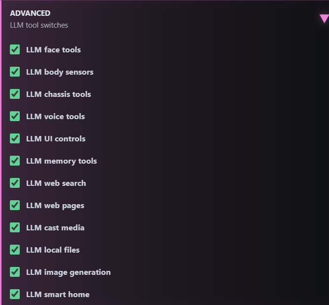

**Advanced** controls which tool families Eric is offered: face, body sensors,
chassis, voice, UI, memory, web search, web pages, cast media, local files, image
generation, and smart home. A checked box permits the capability; it does not
prove the target server, credentials, device, or network are available. Tool
results in Events are the receipt for what actually happened.

Disabling a tool family is different from deleting a memory or changing the
creature prompt. Be especially deliberate with physical motion, smart-home
actions, file writes, and paid image generation.

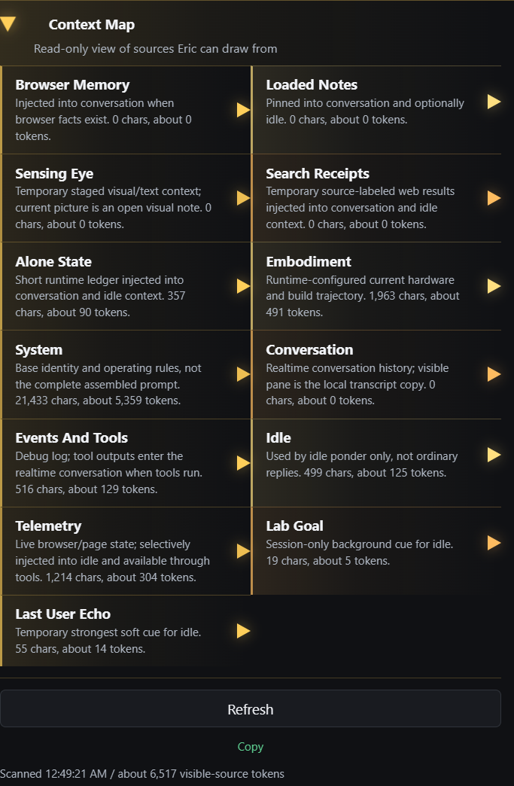

**Context Map** is a read-only inspection view of the sources Eric can draw
from: browser facts, loaded notes, sensing eye, search receipts, alone state,
embodiment, system instructions, conversation, events/tools, and usage. Expand
an individual source to inspect its text. Counts are estimates, not a complete
token-by-token view of the model's actual request.

In particular, the **System** source is the base identity/rules, not the entire
assembled request with every tool schema and runtime addition. STS constructs
context for the current point in time. The root full-prompt text exports are
snapshots/examples of that assembly; their claims about eye, recording, tools,
and environment belong to the time they were exported. Recorded prompt ledgers
are the better evidence for a particular turn.

## When Something Looks Wrong

| Symptom | First checks |
| --- | --- |
| Site cannot be reached | Is the page server running? Local HTTP and apartment HTTPS are different paths; the gateway must be running for the latter. |
| Page opens but Connect fails | Check the realtime endpoint, backend process, and Events. A page server is not the realtime server. |
| Eric does not hear me | Connected, correct mic, permission, Start Mic, meter, Mute Me, then Fresh Ears. |
| Transcript appears but I hear nothing | Check Mute Eric, output volume, browser/device playback, and TTS errors. |
| Picture vanished at Connect | Expected: new connections clear the eye. Drop it after connecting. |
| Idle is silent | Read Idle status. Check drift, active work, modes, and brakes before increasing speed. |
| Brain 2 keeps skipping | Read the skip reason. No fresh conversational evidence, an in-flight pass, or disabled gates are not necessarily failures. |
| No headline after a few accelerated seconds | The quiet/cooldown gates use real time. Check the headline recipe and receipts. |
| Recording stopped but no finished file yet | Wait for finalization; inspect Events for completion or an error. Keep the page open. |
| Missing note/summary | Refresh the list and inspect the selected form/dependency warning. Selecting a missing summary does not generate it. |
| An unfamiliar reset changed context | Reconnect explicitly from the desired session and inspect Context Map. Avoid Clear controls during a run you want to preserve. |

## Companion Documents

- [Operator Cheat Sheet](../scripts/operator-cheatsheet.md): addresses, startup,
  shutdown, LAN gateway, and compact Browser Face window.
- [Context Engineering Architecture](context-engineering-architecture.md):
  loading, dependency handling, runtime truth, and private headline work.
- [Experimental Controls](experimental_controls.md): deeper lab design notes
  and preset history. Use this dated UI guide for the current button meanings.
- [Prosody And Mouth](prosody-and-mouth.md): annotations and speech delivery.
- [Repository Map](repository-map.md): where working notes, evidence, archives,
  and public material belong.

## Maintenance

This guide was checked against `web/sts/index.html`, `web/sts/session-map.html`,
and their server handlers. Screenshots live together under
`docs/assets/sts-ui/2026-09-10/`; they are documentation assets, not public media
gallery entries. When controls change, update the explanations and replace only
the affected section captures. Keep the date honest.
